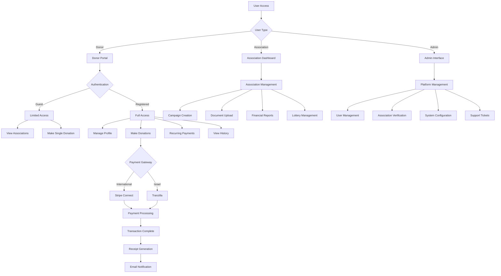
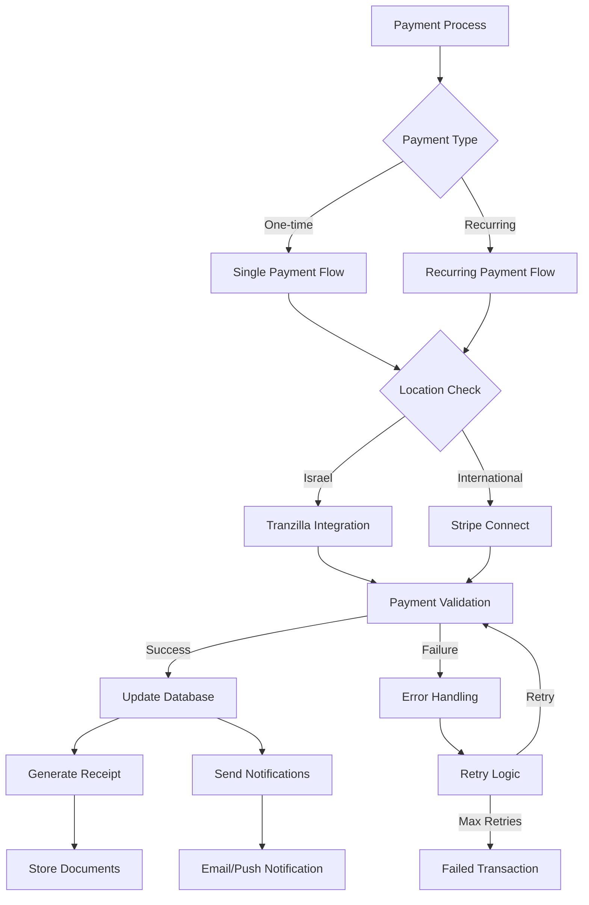
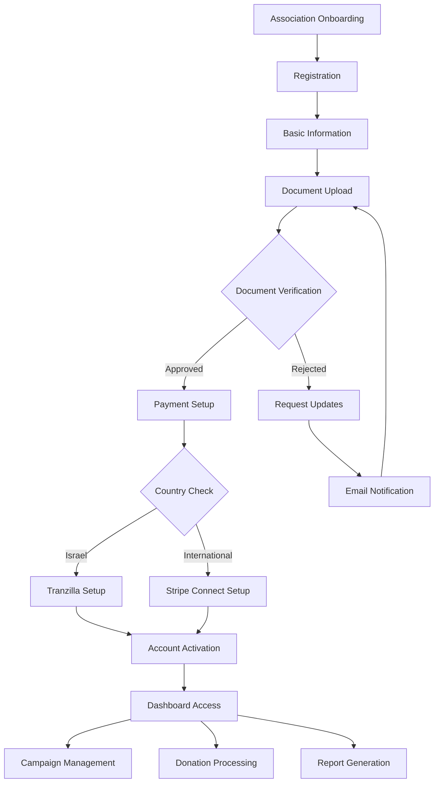
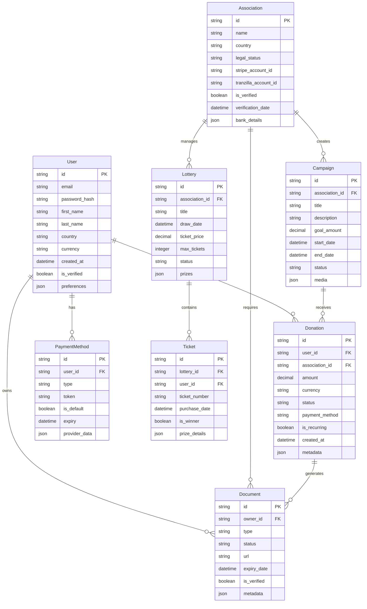
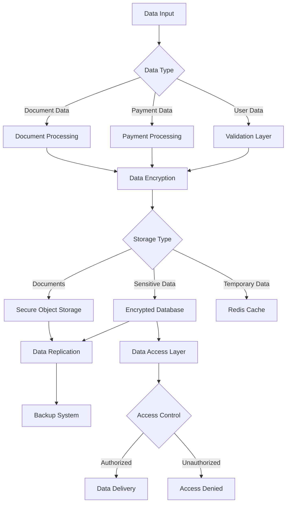
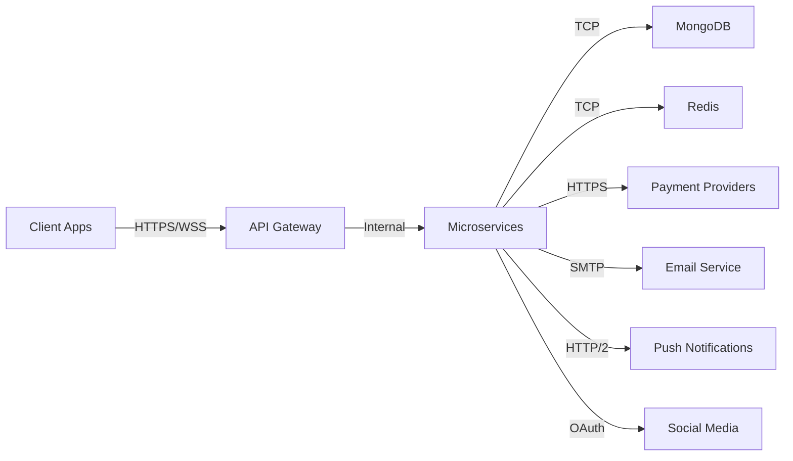

# Product Requirements Document (PRD)

# 1. INTRODUCTION

## 1.1 Purpose
This Software Requirements Specification (SRS) document provides a comprehensive description of the implementation requirements for the International Jewish Association Donation Platform. It is intended for:
- Development teams responsible for building the platform
- Project stakeholders and decision makers
- Quality assurance teams
- System administrators and maintenance personnel
- Integration partners working with payment systems

## 1.2 Scope
The International Jewish Association Donation Platform is a comprehensive web and mobile donation management system that facilitates charitable giving to Jewish associations worldwide. The platform encompasses:

- Multi-platform donation system (web and native mobile applications)
- International payment processing via Stripe Connect and Tranzilla integration
- Three distinct user interfaces:
  - Donor portal for making and managing donations
  - Association management dashboard for receiving and tracking donations
  - Administrative interface for platform oversight

Key Features:
- Secure international payment processing
- Multi-currency support with focus on Israeli market
- Automated tax receipt generation
- Campaign and lottery management
- Real-time donation tracking and reporting
- Social media integration
- Mobile-first responsive design

Benefits:
- Streamlined donation process for international giving
- Reduced administrative overhead for associations
- Enhanced transparency in charitable giving
- Improved donor engagement and retention
- Comprehensive financial reporting and analytics
- Scalable architecture supporting global operations

# 2. PRODUCT DESCRIPTION

## 2.1 Product Perspective
The International Jewish Association Donation Platform operates as a standalone yet interconnected system within the global charitable giving ecosystem. The platform integrates with:

- Payment processing systems (Stripe Connect and Tranzilla)
- Banking institutions for fund transfers
- Tax authorities for receipt generation and compliance
- Social media platforms for sharing and engagement
- Mobile device ecosystems (iOS and Android)
- Association websites via embeddable donation widgets

## 2.2 Product Functions
The platform provides three distinct interfaces with the following core functions:

Donor Interface:
- Account management and profile customization
- Association discovery and favorites management
- Multi-currency donation processing
- Recurring donation setup and management
- Tax receipt generation and storage
- Lottery participation
- Campaign engagement

Association Interface:
- Organization profile management
- Document verification system
- Financial dashboard and reporting
- Campaign creation and management
- Lottery administration
- Donor communication tools
- Payment gateway integration
- QR code generation for donations

Administrative Interface:
- User and association account management
- Platform-wide analytics and reporting
- Payment processing oversight
- Compliance monitoring
- Support ticket management
- System configuration controls

## 2.3 User Characteristics

### Donors
- Primary age range: 25-65 years
- Technology comfort level: Basic to advanced
- Geographic distribution: Global, with focus on Jewish communities
- Language requirements: Multi-lingual (Hebrew, English, French primary)
- Access patterns: Both mobile and desktop usage
- Financial capacity: Various income levels

### Association Representatives
- Role: Financial officers and administrators
- Technical expertise: Intermediate
- Regulatory knowledge: High understanding of local charity laws
- Time availability: Part-time platform engagement
- Training needs: Moderate to high

### System Administrators
- Technical expertise: Advanced
- Platform knowledge: Comprehensive
- Security clearance: High-level access
- Available hours: 24/7 rotating shifts
- Training level: Expert

## 2.4 Constraints

Technical Constraints:
- Must maintain PCI DSS compliance for payment processing
- Real-time synchronization between multiple payment gateways
- Cross-platform compatibility requirements
- Mobile device fragmentation considerations

Regulatory Constraints:
- GDPR compliance for European users
- Local charity laws compliance in each operating country
- Financial regulations for international money transfers
- Tax law compliance across multiple jurisdictions

Business Constraints:
- Processing fees limitations
- Response time requirements (< 2 seconds for transactions)
- 99.9% system uptime requirement
- Scalability to handle peak donation periods

## 2.5 Assumptions and Dependencies

Assumptions:
- Stable internet connectivity for users
- Access to modern web browsers and mobile devices
- Basic technical literacy of users
- Availability of required documentation from associations
- Cooperation from financial institutions

Dependencies:
- Stripe Connect and Tranzilla API availability
- Mobile platform app store approvals
- Third-party authentication services
- Cloud infrastructure reliability
- Payment gateway processing times
- Social media platform APIs
- Email delivery services
- SMS gateway services

# 3. PROCESS FLOWCHART







# 4. FUNCTIONAL REQUIREMENTS

## 4.1 User Authentication and Management

### ID: F001
### Description: User registration, authentication, and profile management system
### Priority: High

| Requirement ID | Requirement Description | Acceptance Criteria |
|---------------|------------------------|-------------------|
| F001.1 | Two-step registration process for donors | - Email/password registration<br>- Personal information collection<br>- Automatic welcome email sent |
| F001.2 | Three-step registration for associations | - Email/password registration<br>- Association information collection<br>- Treasurer information verification |
| F001.3 | Social media authentication integration | - Support for major social platforms<br>- Profile data synchronization |
| F001.4 | Password reset functionality | - Secure reset link generation<br>- 24-hour link expiration<br>- Email notification |
| F001.5 | Profile management interface | - Edit personal/organization info<br>- Update contact details<br>- Manage notification preferences |

## 4.2 Payment Processing

### ID: F002
### Description: Multi-gateway payment processing system
### Priority: Critical

| Requirement ID | Requirement Description | Acceptance Criteria |
|---------------|------------------------|-------------------|
| F002.1 | Stripe Connect integration | - International payment processing<br>- Multi-currency support<br>- Automated fee calculation |
| F002.2 | Tranzilla integration for Israel | - Shekel processing<br>- Israeli bank compliance<br>- Local payment methods |
| F002.3 | Recurring payment management | - Flexible scheduling options<br>- Failed payment handling<br>- Cancellation workflow |
| F002.4 | Payment method storage | - Secure card tokenization<br>- Multiple card management<br>- Default payment method selection |
| F002.5 | Transaction reporting | - Real-time processing status<br>- Detailed transaction history<br>- Export capabilities |

## 4.3 Campaign Management

### ID: F003
### Description: Campaign creation and management system
### Priority: High

| Requirement ID | Requirement Description | Acceptance Criteria |
|---------------|------------------------|-------------------|
| F003.1 | Campaign creation interface | - Goal setting<br>- Timeline management<br>- Media upload capabilities |
| F003.2 | Progress tracking | - Real-time donation tracking<br>- Goal visualization<br>- Donor statistics |
| F003.3 | Social sharing integration | - Multi-platform sharing<br>- Custom campaign links<br>- Social media preview |
| F003.4 | Campaign analytics | - Donor demographics<br>- Conversion tracking<br>- Performance metrics |
| F003.5 | Campaign templates | - Reusable templates<br>- Customization options<br>- Quick launch functionality |

## 4.4 Lottery System

### ID: F004
### Description: Online lottery management system
### Priority: Medium

| Requirement ID | Requirement Description | Acceptance Criteria |
|---------------|------------------------|-------------------|
| F004.1 | Lottery creation tools | - Prize management<br>- Ticket pricing<br>- Duration setting |
| F004.2 | Ticket sales processing | - Multiple ticket purchases<br>- Bulk discount options<br>- Digital ticket delivery |
| F004.3 | Winner selection system | - Automated random selection<br>- Verification process<br>- Winner notification |
| F004.4 | Prize distribution tracking | - Winner contact management<br>- Shipping status tracking<br>- Prize claim verification |
| F004.5 | Lottery reporting | - Sales analytics<br>- Participant demographics<br>- Revenue reporting |

## 4.5 Document Management

### ID: F005
### Description: Document handling and storage system
### Priority: High

| Requirement ID | Requirement Description | Acceptance Criteria |
|---------------|------------------------|-------------------|
| F005.1 | Tax receipt generation | - Automatic generation<br>- Country-specific formats<br>- Digital signature support |
| F005.2 | Association document verification | - Document upload interface<br>- Verification workflow<br>- Expiration tracking |
| F005.3 | Document storage | - Secure cloud storage<br>- Version control<br>- Access management |
| F005.4 | Document retrieval | - Search functionality<br>- Batch download options<br>- Archive access |
| F005.5 | Compliance tracking | - Document validity monitoring<br>- Renewal notifications<br>- Compliance reporting |

## 4.6 Reporting and Analytics

### ID: F006
### Description: Comprehensive reporting and analytics system
### Priority: High

| Requirement ID | Requirement Description | Acceptance Criteria |
|---------------|------------------------|-------------------|
| F006.1 | Financial reporting | - Transaction summaries<br>- Revenue analytics<br>- Fee calculations |
| F006.2 | Donor analytics | - Giving patterns<br>- Retention metrics<br>- Engagement analysis |
| F006.3 | Association performance metrics | - Campaign success rates<br>- Donor acquisition costs<br>- Growth trends |
| F006.4 | Platform analytics | - User activity metrics<br>- System performance data<br>- Usage patterns |
| F006.5 | Custom report generation | - Flexible filtering<br>- Multiple export formats<br>- Scheduled reports |

# 5. NON-FUNCTIONAL REQUIREMENTS

## 5.1 Performance Requirements

| Category | Requirement | Target Metric |
|----------|-------------|---------------|
| Response Time | API endpoint response | < 200ms for 95% of requests |
| Response Time | Page load time | < 2 seconds for initial load |
| Response Time | Payment processing | < 3 seconds for transaction completion |
| Throughput | Concurrent users | Support 10,000 simultaneous users |
| Throughput | Transaction processing | 1000 transactions per minute |
| Resource Usage | CPU utilization | < 70% under normal load |
| Resource Usage | Memory usage | < 80% of available RAM |
| Resource Usage | Database connections | Maximum 80% connection pool usage |

## 5.2 Safety Requirements

| Category | Requirement | Implementation |
|----------|-------------|----------------|
| Data Backup | Real-time replication | Multi-region database replication |
| Data Backup | Backup frequency | Hourly incremental, daily full backup |
| Disaster Recovery | Recovery Time Objective (RTO) | < 4 hours |
| Disaster Recovery | Recovery Point Objective (RPO) | < 15 minutes |
| Failure Handling | Graceful degradation | Fallback to essential services only |
| System Monitoring | Health checks | 1-minute interval monitoring |
| Error Prevention | Input validation | Client and server-side validation |
| Transaction Safety | Payment atomicity | Two-phase commit protocol |

## 5.3 Security Requirements

| Category | Requirement | Specification |
|----------|-------------|---------------|
| Authentication | Multi-factor authentication | Required for high-value transactions |
| Authentication | Session management | 30-minute timeout, secure cookie handling |
| Authorization | Role-based access control | Granular permission system |
| Data Protection | Encryption at rest | AES-256 encryption for stored data |
| Data Protection | Encryption in transit | TLS 1.3 for all communications |
| API Security | Rate limiting | 100 requests per minute per IP |
| API Security | Input sanitization | Protection against XSS and SQL injection |
| Audit | Security logging | All security events logged and monitored |

## 5.4 Quality Requirements

| Category | Metric | Target |
|----------|--------|--------|
| Availability | System uptime | 99.9% excluding planned maintenance |
| Availability | Planned downtime | < 4 hours per month |
| Maintainability | Code coverage | Minimum 80% test coverage |
| Maintainability | Documentation | Updated within 24 hours of changes |
| Usability | Error rate | < 1% for completed transactions |
| Usability | User satisfaction | > 4.5/5 rating in user surveys |
| Scalability | Horizontal scaling | Auto-scaling based on load |
| Scalability | Data growth | Support 50% annual data growth |
| Reliability | Mean Time Between Failures | > 720 hours |
| Reliability | Mean Time To Recovery | < 30 minutes |

## 5.5 Compliance Requirements

| Category | Requirement | Standard/Regulation |
|----------|-------------|-------------------|
| Payment Processing | PCI DSS compliance | Level 1 PCI DSS certification |
| Data Protection | GDPR compliance | Full compliance with EU GDPR |
| Data Protection | CCPA compliance | California Consumer Privacy Act |
| Financial | SOX compliance | For financial reporting |
| Accessibility | WCAG compliance | WCAG 2.1 Level AA |
| Security | ISO 27001 | Information security management |
| Banking | Israeli banking regulations | Compliance with Bank of Israel requirements |
| Charitable | International donation laws | Compliance with local charity regulations |

## 5.6 Technical Requirements

| Category | Requirement | Specification |
|----------|-------------|---------------|
| Browser Support | Desktop browsers | Latest 2 versions of major browsers |
| Browser Support | Mobile browsers | iOS Safari, Android Chrome |
| Mobile Support | Native apps | iOS 13+, Android 8+ |
| Network | Bandwidth optimization | Maximum 2MB initial page load |
| Network | CDN coverage | Global CDN with 99.9% availability |
| Database | Query performance | < 100ms for 95% of queries |
| Database | Data retention | 7 years for financial records |
| API | Documentation | OpenAPI 3.0 specification |

# 6. DATA REQUIREMENTS

## 6.1 Data Models



## 6.2 Data Storage

### 6.2.1 Primary Storage
- MongoDB as primary database
- Sharded clusters for horizontal scaling
- Separate databases for production, staging, and development
- Geographically distributed replica sets for high availability

### 6.2.2 Data Retention
| Data Type | Retention Period | Storage Type |
|-----------|-----------------|--------------|
| Transaction Records | 7 years | Primary Database |
| User Profiles | Account lifetime + 2 years | Primary Database |
| Documents/Receipts | 10 years | Object Storage |
| Audit Logs | 3 years | Archive Storage |
| Session Data | 30 days | Redis |
| Cache Data | 24 hours | Redis |

### 6.2.3 Backup Strategy
- Real-time replication across multiple availability zones
- Hourly incremental backups
- Daily full backups retained for 30 days
- Monthly backups retained for 7 years
- Encrypted backup storage in multiple geographic regions

### 6.2.4 Recovery Procedures
- Automated failover for replica sets
- Point-in-time recovery capability
- Multi-region disaster recovery
- Regular recovery testing schedule
- Maximum 4-hour recovery time objective (RTO)

## 6.3 Data Processing



### 6.3.1 Data Security
- End-to-end encryption for sensitive data
- Field-level encryption for PII
- Encryption at rest using AES-256
- TLS 1.3 for data in transit
- Regular security audits and penetration testing

### 6.3.2 Data Processing Rules
| Process Type | Rule Set |
|-------------|----------|
| User Data | Input validation, PII encryption, GDPR compliance |
| Payment Data | PCI DSS compliance, tokenization, fraud detection |
| Documents | Virus scanning, format validation, metadata stripping |
| Analytics | Data anonymization, aggregation rules |
| Exports | Rate limiting, size restrictions, format validation |

### 6.3.3 Data Integration
- Real-time synchronization with payment providers
- Batch processing for reporting and analytics
- Event-driven architecture for data updates
- Message queuing for asynchronous processing
- API rate limiting and throttling

# 7. EXTERNAL INTERFACES

## 7.1 User Interfaces

### 7.1.1 Web Interface
- Responsive design supporting desktop (1920x1080) to mobile (320px minimum width)
- Material Design 3 components and styling
- Support for RTL languages (Hebrew)
- WCAG 2.1 Level AA compliance
- Maximum load time of 2 seconds for initial render
- Keyboard navigation support
- Screen reader compatibility

### 7.1.2 Mobile Interface
- Native iOS (iOS 13+) and Android (Android 8+) applications
- Platform-specific design guidelines adherence
- Portrait and landscape orientation support
- Offline functionality for core features
- Deep linking support
- Biometric authentication integration
- Push notification handling

### 7.1.3 Common UI Requirements
| Interface Element | Requirement |
|------------------|-------------|
| Color Contrast | Minimum ratio 4.5:1 |
| Touch Targets | Minimum 44x44 pixels |
| Loading States | Skeleton screens for content loading |
| Error States | Clear error messaging with recovery actions |
| Forms | Inline validation with accessibility support |
| Navigation | Breadcrumb trails and clear hierarchy |
| Typography | Minimum 16px base font size |

## 7.2 Hardware Interfaces

### 7.2.1 Mobile Device Hardware
| Component | Interface Requirement |
|-----------|---------------------|
| Camera | QR code scanning for payments |
| Biometric Sensors | Fingerprint/Face ID authentication |
| GPS | Location-based association discovery |
| NFC | Contactless payment integration |

### 7.2.2 Payment Hardware
| Device Type | Integration Requirement |
|------------|----------------------|
| Card Readers | Stripe Terminal API integration |
| POS Systems | Tranzilla POS protocol support |
| Receipt Printers | CUPS printing protocol support |

## 7.3 Software Interfaces

### 7.3.1 Payment Processing
```json
{
  "Stripe": {
    "version": "2023-10-16",
    "endpoints": [
      "connect/*",
      "payment_intents/*",
      "accounts/*"
    ],
    "authentication": "API Key + OAuth",
    "dataFormat": "JSON"
  },
  "Tranzilla": {
    "version": "1.0",
    "endpoints": [
      "payment/*",
      "status/*"
    ],
    "authentication": "Terminal ID + API Key",
    "dataFormat": "XML"
  }
}
```

### 7.3.2 External Services
| Service | Interface Type | Protocol | Data Format |
|---------|---------------|----------|-------------|
| MongoDB Atlas | Database | MongoDB Wire Protocol | BSON |
| Redis Cloud | Cache | Redis Protocol | Binary |
| SendGrid | Email | REST API | JSON |
| Firebase | Push Notifications | HTTP/2 | JSON |
| Social Media APIs | Authentication/Sharing | OAuth 2.0 | JSON |

## 7.4 Communication Interfaces

### 7.4.1 Network Protocols
| Protocol | Usage | Specification |
|----------|-------|--------------|
| HTTPS | All API communication | TLS 1.3 |
| WebSocket | Real-time updates | WSS protocol |
| GraphQL | Data queries | Apollo implementation |
| REST | External APIs | OpenAPI 3.0 |

### 7.4.2 Data Exchange Formats
```json
{
  "standardFormats": {
    "API": "JSON",
    "Documents": "PDF",
    "Images": ["JPEG", "PNG", "WebP"],
    "Data Export": ["CSV", "JSON", "XML"],
    "Backup": "BSON"
  },
  "compression": {
    "HTTP": "gzip",
    "WebSocket": "permessage-deflate",
    "Assets": "Brotli"
  }
}
```

### 7.4.3 Integration Points


# 8. APPENDICES

## 8.1 GLOSSARY

| Term | Definition |
|------|------------|
| Association | A registered charitable organization eligible to receive donations through the platform |
| Campaign | A time-bound fundraising initiative created by an association |
| CERFA | French tax receipt document (Certificat de don aux œuvres) |
| Connect | Stripe's platform for marketplace payment processing |
| Lottery | A charitable raffle system with digital tickets and automated winner selection |
| Tombola | Alternative term for lottery/raffle system used in French-speaking regions |
| Wallet | Digital account for managing received donations and payouts |
| Widget | Embeddable donation form for association websites |

## 8.2 ACRONYMS

| Acronym | Expansion |
|---------|-----------|
| API | Application Programming Interface |
| BSON | Binary JSON |
| CCPA | California Consumer Privacy Act |
| CDN | Content Delivery Network |
| CUPS | Common Unix Printing System |
| GDPR | General Data Protection Regulation |
| NFC | Near Field Communication |
| PCI DSS | Payment Card Industry Data Security Standard |
| PII | Personally Identifiable Information |
| PWA | Progressive Web Application |
| RGPD | Règlement Général sur la Protection des Données (French GDPR) |
| RTL | Right-to-Left |
| SLA | Service Level Agreement |
| SPA | Single Page Application |
| TLS | Transport Layer Security |
| WCAG | Web Content Accessibility Guidelines |
| WSS | WebSocket Secure |
| XSS | Cross-Site Scripting |

## 8.3 ADDITIONAL REFERENCES

### 8.3.1 Technical Documentation
- [Stripe Connect API Documentation](https://stripe.com/docs/connect)
- [MongoDB Atlas Best Practices](https://www.mongodb.com/docs/atlas/best-practices/)
- [React.js Performance Optimization](https://reactjs.org/docs/optimizing-performance.html)
- [iOS Human Interface Guidelines](https://developer.apple.com/design/human-interface-guidelines/)
- [Material Design Guidelines](https://material.io/design)

### 8.3.2 Regulatory Resources
- [GDPR Official Documentation](https://gdpr.eu/)
- [PCI DSS Requirements](https://www.pcisecuritystandards.org/)
- [Israeli Banking Regulations](https://www.boi.org.il/)
- [International Donation Laws Database](https://www.cof.org/content/nonprofit-law-worldwide)

### 8.3.3 Development Standards
- [OpenAPI Specification](https://swagger.io/specification/)
- [REST API Design Guidelines](https://github.com/microsoft/api-guidelines)
- [GraphQL Best Practices](https://graphql.org/learn/best-practices/)
- [Mobile App Security Guidelines](https://owasp.org/www-project-mobile-security/)

### 8.3.4 Testing Resources
- [Jest Testing Framework](https://jestjs.io/)
- [Mobile App Testing Guidelines](https://developer.android.com/training/testing)
- [Load Testing with k6](https://k6.io/docs/)
- [Security Testing Checklist](https://owasp.org/www-project-web-security-testing-guide/)