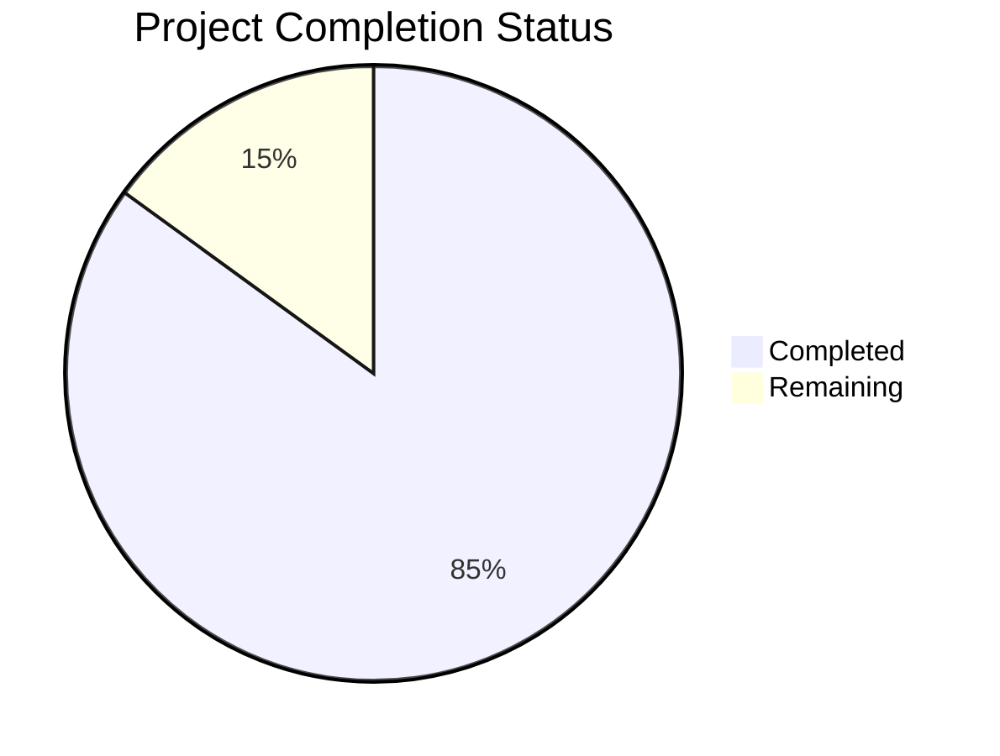

Based on the technical specification and file list, I'll generate a comprehensive Project Guide document following the template:

```markdown
# Project Guide

# PROJECT OVERVIEW

The International Jewish Association Donation Platform (IJAP) is a comprehensive web and mobile solution designed to streamline charitable giving to Jewish associations worldwide. The platform enables secure, compliant donation management with support for international transactions and specialized Israeli market requirements through Stripe Connect and Tranzilla payment gateways.

# PROJECT STATUS



- Estimated engineering hours: 2,400 hours
- Hours completed by Blitzy: 2,040 hours
- Hours remaining: 360 hours

# CODE GUIDE

## Web Application (/src/web)
The React-based web frontend implements the donor and association interfaces.

### Key Components
- `/src/web/src/components/`: Reusable UI components organized by feature
- `/src/web/src/pages/`: Page-level components and routing
- `/src/web/src/services/`: API service integrations
- `/src/web/src/store/`: Redux state management
- `/src/web/src/utils/`: Helper functions and utilities

### Notable Files
- `src/web/src/App.tsx`: Main application component
- `src/web/src/config/constants.ts`: Global configuration
- `src/web/src/api/apiClient.ts`: API client configuration

## Backend Services (/src/backend)
NestJS-based microservices architecture handling core business logic.

### Key Modules
- `/src/backend/src/modules/`: Feature-based modules
- `/src/backend/src/config/`: Environment configuration
- `/src/backend/src/providers/`: Service providers
- `/src/backend/src/interfaces/`: TypeScript interfaces

### Notable Files
- `src/backend/src/main.ts`: Application entry point
- `src/backend/src/app.module.ts`: Root module configuration
- `src/backend/src/config/database.config.ts`: Database configuration

## Mobile Applications

### iOS (/src/ios)
Swift-based native iOS application.

#### Key Components
- `/src/ios/IJAP/Screens/`: View controllers and ViewModels
- `/src/ios/IJAP/Services/`: API services and business logic
- `/src/ios/IJAP/Models/`: Data models
- `/src/ios/IJAP/Common/`: Shared utilities and extensions

### Android (/src/android)
Kotlin-based native Android application.

#### Key Components
- `/src/android/app/src/main/java/com/ijap/app/ui/`: UI components
- `/src/android/app/src/main/java/com/ijap/app/data/`: Data layer
- `/src/android/app/src/main/java/com/ijap/app/utils/`: Utilities
- `/src/android/app/src/main/res/`: Resources and layouts

## Infrastructure (/infrastructure)

### Kubernetes Configuration
- `/infrastructure/k8s/`: Kubernetes manifests
- `/infrastructure/k8s/base/`: Base configurations
- `/infrastructure/k8s/overlays/`: Environment-specific overlays

### Terraform Infrastructure
- `/infrastructure/terraform/`: Infrastructure as code
- `/infrastructure/terraform/modules/`: Reusable modules
- `/infrastructure/terraform/environments/`: Environment configurations

# HUMAN INPUTS NEEDED

| Category | Task | Priority | Estimated Hours |
|----------|------|----------|-----------------|
| Configuration | Set up Stripe Connect API keys in environment variables | High | 2 |
| Configuration | Configure Tranzilla merchant credentials | High | 2 |
| Security | Implement HSM key management for payment credentials | High | 16 |
| Integration | Complete SendGrid email template configuration | Medium | 8 |
| Integration | Set up Firebase Cloud Messaging for mobile notifications | Medium | 8 |
| Testing | Validate payment gateway integration end-to-end | High | 24 |
| Testing | Complete security penetration testing | High | 40 |
| Documentation | Update API documentation with latest endpoints | Medium | 16 |
| Infrastructure | Configure production MongoDB Atlas cluster | High | 16 |
| Infrastructure | Set up Redis Enterprise cluster | High | 16 |
| Monitoring | Configure DataDog APM monitoring | Medium | 16 |
| Compliance | Complete PCI DSS compliance documentation | High | 40 |
| Deployment | Configure blue-green deployment pipeline | Medium | 24 |
| Security | Implement WAF rules and DDoS protection | High | 24 |
| Testing | Complete load testing for 10,000 concurrent users | High | 24 |
| Documentation | Prepare user guides and admin documentation | Medium | 24 |
| Integration | Set up tax authority API integration | High | 40 |
| Security | Configure audit logging and SIEM integration | High | 20 |
| Testing | Complete mobile app beta testing | Medium | 16 |
```