# Technical Specifications

# 1. INTRODUCTION

## 1.1 EXECUTIVE SUMMARY

The International Jewish Association Donation Platform is a comprehensive web and mobile solution designed to streamline charitable giving to Jewish associations worldwide. The platform addresses the critical need for a unified, secure, and compliant donation management system that can handle international transactions while meeting specific requirements for the Israeli market. By connecting donors with verified associations through multiple payment gateways (Stripe Connect and Tranzilla), the platform enables efficient fund distribution while ensuring regulatory compliance across jurisdictions.

Primary stakeholders include donors, Jewish charitable associations, financial administrators, and platform operators. The system is expected to significantly increase donation efficiency, reduce administrative overhead, and provide transparent tracking of charitable funds across international borders.

## 1.2 SYSTEM OVERVIEW

### Project Context

| Aspect | Description |
|--------|-------------|
| Business Context | First-of-its-kind unified platform for Jewish charitable giving with global reach and local compliance |
| Market Position | Primary platform for international Jewish association donations with specialized Israeli market support |
| Current Limitations | Fragmented donation systems, complex international payments, inconsistent tax documentation |
| Enterprise Integration | Seamless integration with existing association management systems and financial platforms |

### High-Level Description

The system comprises three primary components:

1. Multi-platform user interfaces:
   - Responsive web application
   - Native mobile apps (iOS/Android)
   - Association management dashboard

2. Core processing systems:
   - Dual payment gateway integration
   - Document management system
   - Campaign and lottery management
   - Real-time reporting and analytics

3. Integration layer:
   - Payment processor APIs
   - Banking systems
   - Tax authority interfaces
   - Social media platforms

### Success Criteria

| Category | Metrics |
|----------|---------|
| Performance | - 99.9% system uptime<br>- < 2 second transaction processing<br>- Support for 10,000 concurrent users |
| Business | - 50% reduction in administrative overhead<br>- 30% increase in donation volume<br>- 95% donor satisfaction rate |
| Technical | - PCI DSS Level 1 compliance<br>- GDPR/CCPA compliance<br>- < 0.1% transaction failure rate |

## 1.3 SCOPE

### In-Scope Elements

#### Core Features and Functionalities

| Category | Components |
|----------|------------|
| User Management | - Multi-step registration<br>- Role-based access control<br>- Profile management<br>- Authentication/Authorization |
| Payment Processing | - International transactions (Stripe)<br>- Israeli market support (Tranzilla)<br>- Multi-currency support<br>- Recurring payments |
| Campaign Management | - Campaign creation/tracking<br>- Lottery system<br>- Progress monitoring<br>- Social sharing |
| Documentation | - Automated tax receipt generation<br>- Document verification<br>- Secure storage<br>- Audit trail |

#### Implementation Boundaries

| Boundary Type | Coverage |
|--------------|----------|
| Geographic | Global with specialized support for Israel |
| User Groups | Donors, Associations, Administrators |
| Data Domains | Financial, Personal, Organizational |
| Language Support | Hebrew, English, French |

### Out-of-Scope Elements

- Direct integration with non-Jewish charitable organizations
- Cryptocurrency payment processing
- Physical donation collection management
- Event ticketing system
- Volunteer management system
- Grant application processing
- Direct investment management
- Merchandise sales platform

Future phase considerations include:
- AI-powered donation recommendations
- Advanced donor relationship management
- Expanded payment gateway integrations
- Enhanced mobile payment options
- Automated compliance monitoring system

# 2. SYSTEM ARCHITECTURE

## 2.1 High-Level Architecture

The International Jewish Association Donation Platform employs a microservices architecture pattern to ensure scalability, maintainability, and resilience. The system is designed to handle high-concurrency donation processing while maintaining strict security and compliance requirements.

### 2.1.1 System Context Diagram (Level 0)

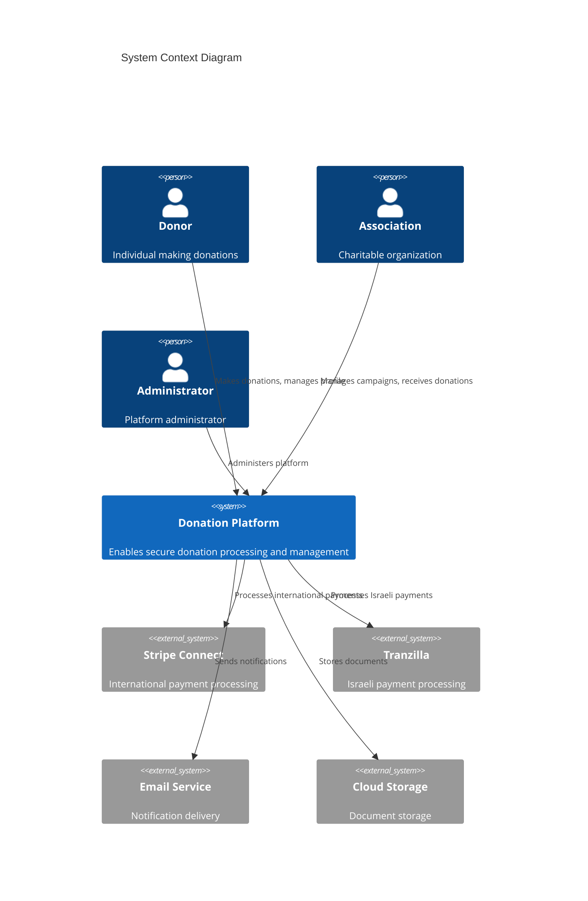
```mermaid
C4Context
    title System Context Diagram
    
    Person(donor, "Donor", "Individual making donations")
    Person(assoc, "Association", "Charitable organization")
    Person(admin, "Administrator", "Platform administrator")
    
    System(platform, "Donation Platform", "Enables secure donation processing and management")
    
    System_Ext(stripe, "Stripe Connect", "International payment processing")
    System_Ext(tranzilla, "Tranzilla", "Israeli payment processing")
    System_Ext(email, "Email Service", "Notification delivery")
    System_Ext(storage, "Cloud Storage", "Document storage")
    
    Rel(donor, platform, "Makes donations, manages profile")
    Rel(assoc, platform, "Manages campaigns, receives donations")
    Rel(admin, platform, "Administers platform")
    
    Rel(platform, stripe, "Processes international payments")
    Rel(platform, tranzilla, "Processes Israeli payments")
    Rel(platform, email, "Sends notifications")
    Rel(platform, storage, "Stores documents")
```

### 2.1.2 Container Diagram (Level 1)

```mermaid
C4Container
    title Container Diagram
    
    Person(user, "User", "Platform user")
    
    Container(web, "Web Application", "React.js", "User interface for donors and associations")
    Container(mobile, "Mobile Apps", "iOS/Android", "Native mobile applications")
    Container(api, "API Gateway", "Node.js/Express", "API gateway and request routing")
    
    Container_Boundary(services, "Microservices") {
        Container(auth, "Auth Service", "Node.js", "Authentication and authorization")
        Container(payment, "Payment Service", "Node.js", "Payment processing")
        Container(campaign, "Campaign Service", "Node.js", "Campaign management")
        Container(doc, "Document Service", "Node.js", "Document handling")
    }
    
    ContainerDb(db, "Database", "MongoDB", "Primary data store")
    ContainerDb(cache, "Cache", "Redis", "Session and data caching")
    
    Rel(user, web, "Uses", "HTTPS")
    Rel(user, mobile, "Uses", "HTTPS")
    Rel(web, api, "API calls", "HTTPS/WSS")
    Rel(mobile, api, "API calls", "HTTPS/WSS")
    
    Rel(api, auth, "Routes requests", "gRPC")
    Rel(api, payment, "Routes requests", "gRPC")
    Rel(api, campaign, "Routes requests", "gRPC")
    Rel(api, doc, "Routes requests", "gRPC")
    
    Rel(services, db, "Reads/Writes data", "TCP")
    Rel(services, cache, "Caches data", "TCP")
```

## 2.2 Component Details

### 2.2.1 Core Components

| Component | Technology Stack | Purpose | Scaling Strategy |
|-----------|-----------------|---------|------------------|
| API Gateway | Node.js, Express | Request routing, rate limiting | Horizontal with load balancer |
| Auth Service | Node.js, JWT | User authentication, authorization | Horizontal with session stickiness |
| Payment Service | Node.js, Stripe/Tranzilla SDKs | Payment processing | Horizontal with queue-based processing |
| Campaign Service | Node.js, MongoDB | Campaign management | Horizontal with sharded database |
| Document Service | Node.js, S3 compatible | Document handling | Horizontal with CDN integration |

### 2.2.2 Data Flow Diagram

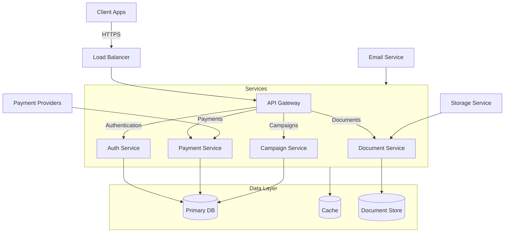
```mermaid
flowchart TD
    A[Client Apps] -->|HTTPS| B[Load Balancer]
    B --> C[API Gateway]
    
    subgraph Services
        C -->|Authentication| D[Auth Service]
        C -->|Payments| E[Payment Service]
        C -->|Campaigns| F[Campaign Service]
        C -->|Documents| G[Document Service]
    end
    
    subgraph Data Layer
        H[(Primary DB)]
        I[(Cache)]
        J[(Document Store)]
    end
    
    D --> H
    E --> H
    F --> H
    G --> J
    
    Services --> I
    
    K[Payment Providers] --> E
    L[Email Service] --> Services
    M[Storage Service] --> G
```

## 2.3 Technical Decisions

### 2.3.1 Architecture Patterns

| Pattern | Implementation | Justification |
|---------|---------------|---------------|
| Microservices | Domain-driven services | Scalability, maintainability |
| Event-Driven | RabbitMQ message bus | Asynchronous processing |
| CQRS | Separate read/write models | Performance optimization |
| API Gateway | Express.js based | Security, routing |
| Circuit Breaker | Hystrix implementation | Fault tolerance |

### 2.3.2 Deployment Diagram

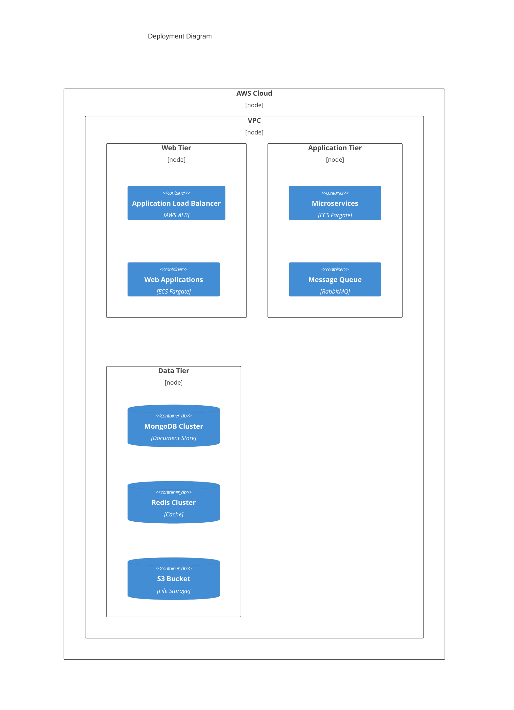
```mermaid
C4Deployment
    title Deployment Diagram
    
    Deployment_Node(aws, "AWS Cloud") {
        Deployment_Node(vpc, "VPC") {
            Deployment_Node(web, "Web Tier") {
                Container(alb, "Application Load Balancer", "AWS ALB")
                Container(web_app, "Web Applications", "ECS Fargate")
            }
            
            Deployment_Node(app, "Application Tier") {
                Container(services, "Microservices", "ECS Fargate")
                Container(queue, "Message Queue", "RabbitMQ")
            }
            
            Deployment_Node(data, "Data Tier") {
                ContainerDb(mongo, "MongoDB Cluster", "Document Store")
                ContainerDb(redis, "Redis Cluster", "Cache")
                ContainerDb(s3, "S3 Bucket", "File Storage")
            }
        }
    }
```

## 2.4 Cross-Cutting Concerns

### 2.4.1 Monitoring and Observability

| Component | Tool | Purpose |
|-----------|------|---------|
| Metrics | Prometheus | Performance monitoring |
| Logging | ELK Stack | Log aggregation |
| Tracing | Jaeger | Distributed tracing |
| Alerting | PagerDuty | Incident management |
| Dashboard | Grafana | Visualization |

### 2.4.2 Security Architecture

```mermaid
flowchart TD
    A[Client] -->|TLS 1.3| B[WAF]
    B --> C[Load Balancer]
    C --> D[API Gateway]
    
    subgraph Security Zones
        D -->|JWT| E[Auth Service]
        D -->|mTLS| F[Payment Service]
        D -->|mTLS| G[Campaign Service]
        D -->|mTLS| H[Document Service]
    end
    
    I[Identity Provider] -->|OAuth 2.0| E
    J[HSM] -->|Key Management| F
    
    K[(Encrypted Data Store)] --> Security Zones
```

### 2.4.3 Disaster Recovery

| Component | Recovery Strategy | RPO | RTO |
|-----------|------------------|-----|-----|
| Database | Multi-region replication | 5 minutes | 1 hour |
| File Storage | Cross-region replication | 15 minutes | 30 minutes |
| Application | Blue-green deployment | N/A | 15 minutes |
| Cache | Redis cluster failover | 1 minute | 5 minutes |
| Message Queue | Mirror queue setup | 30 seconds | 5 minutes |

# 3. SYSTEM COMPONENTS ARCHITECTURE

## 3.1 USER INTERFACE DESIGN

### 3.1.1 Design Specifications

| Category | Specification |
|----------|--------------|
| Visual Hierarchy | Material Design 3.0 principles with Jewish cultural elements |
| Component Library | Custom React component library extending MUI |
| Responsive Breakpoints | xs: 0px, sm: 600px, md: 900px, lg: 1200px, xl: 1536px |
| Accessibility | WCAG 2.1 Level AA compliance |
| Browser Support | Chrome 90+, Firefox 88+, Safari 14+, Edge 90+ |
| Theme Support | Light/Dark modes with automatic system detection |
| RTL Support | Full RTL layout support for Hebrew content |

### 3.1.2 Interface Elements

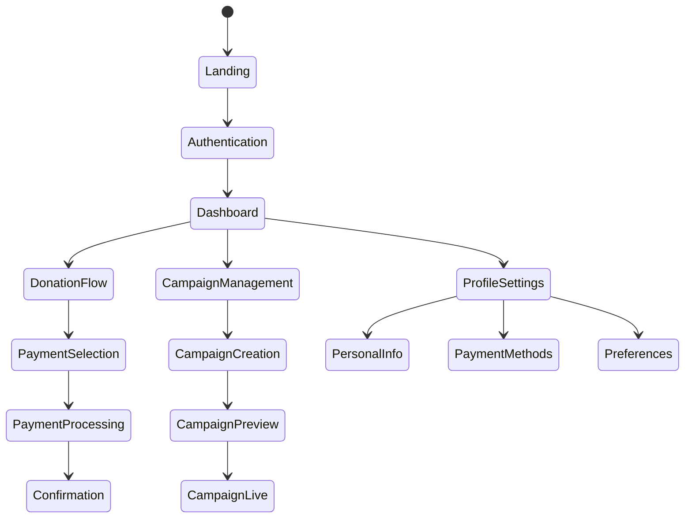
```mermaid
stateDiagram-v2
    [*] --> Landing
    Landing --> Authentication
    Authentication --> Dashboard
    Dashboard --> DonationFlow
    Dashboard --> CampaignManagement
    Dashboard --> ProfileSettings
    
    DonationFlow --> PaymentSelection
    PaymentSelection --> PaymentProcessing
    PaymentProcessing --> Confirmation
    
    CampaignManagement --> CampaignCreation
    CampaignCreation --> CampaignPreview
    CampaignPreview --> CampaignLive
    
    ProfileSettings --> PersonalInfo
    ProfileSettings --> PaymentMethods
    ProfileSettings --> Preferences
```

### 3.1.3 Critical User Flows

| Flow Type | Validation Rules | Error Handling |
|-----------|-----------------|----------------|
| Registration | - Email format validation<br>- Password strength check<br>- Required field validation | - Inline error messages<br>- Form field highlighting<br>- Error recovery suggestions |
| Donation | - Amount validation<br>- Payment method verification<br>- Currency validation | - Payment failure recovery<br>- Alternative payment suggestions<br>- Session recovery |
| Campaign Creation | - Goal amount validation<br>- Date range checks<br>- Media format validation | - Auto-save functionality<br>- Draft recovery<br>- Validation summaries |

## 3.2 DATABASE DESIGN

### 3.2.1 Schema Design

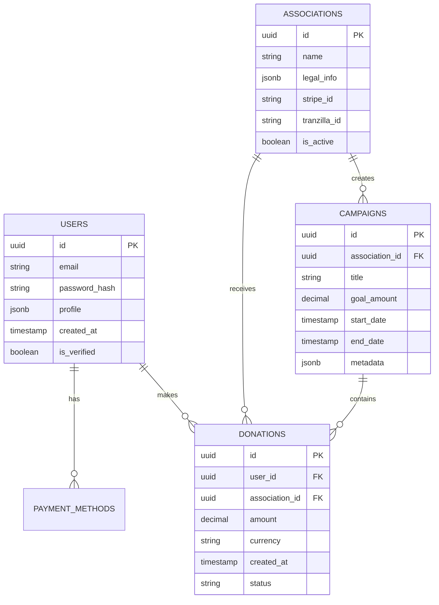
```mermaid
erDiagram
    USERS ||--o{ DONATIONS : makes
    USERS ||--o{ PAYMENT_METHODS : has
    ASSOCIATIONS ||--o{ CAMPAIGNS : creates
    ASSOCIATIONS ||--o{ DONATIONS : receives
    CAMPAIGNS ||--o{ DONATIONS : contains
    
    USERS {
        uuid id PK
        string email
        string password_hash
        jsonb profile
        timestamp created_at
        boolean is_verified
    }
    
    ASSOCIATIONS {
        uuid id PK
        string name
        jsonb legal_info
        string stripe_id
        string tranzilla_id
        boolean is_active
    }
    
    DONATIONS {
        uuid id PK
        uuid user_id FK
        uuid association_id FK
        decimal amount
        string currency
        timestamp created_at
        string status
    }
    
    CAMPAIGNS {
        uuid id PK
        uuid association_id FK
        string title
        decimal goal_amount
        timestamp start_date
        timestamp end_date
        jsonb metadata
    }
```

### 3.2.2 Data Management Strategy

| Aspect | Implementation |
|--------|---------------|
| Sharding Strategy | Hash-based sharding on user_id and association_id |
| Indexing | Compound indexes on frequently queried fields |
| Partitioning | Time-based partitioning for donations and campaigns |
| Backup Schedule | Continuous replication with 15-minute point-in-time recovery |
| Data Retention | 7-year retention for financial data, 2-year for operational data |
| Encryption | Field-level encryption for PII, TDE for data at rest |

## 3.3 API DESIGN

### 3.3.1 API Architecture

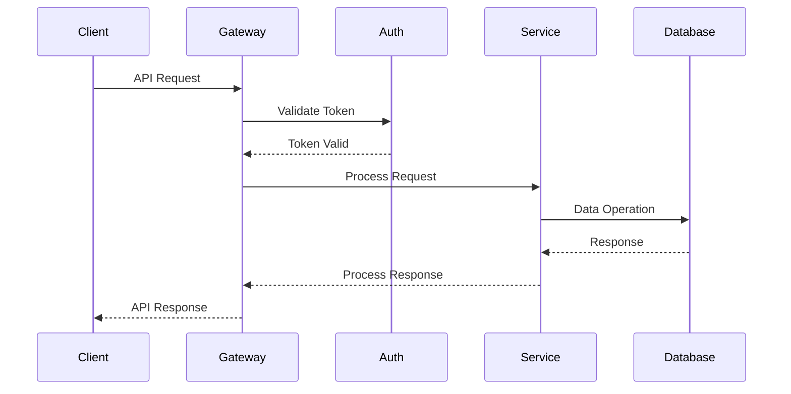
```mermaid
sequenceDiagram
    participant Client
    participant Gateway
    participant Auth
    participant Service
    participant Database
    
    Client->>Gateway: API Request
    Gateway->>Auth: Validate Token
    Auth-->>Gateway: Token Valid
    Gateway->>Service: Process Request
    Service->>Database: Data Operation
    Database-->>Service: Response
    Service-->>Gateway: Process Response
    Gateway-->>Client: API Response
```

### 3.3.2 Interface Specifications

| Endpoint Category | Authentication | Rate Limit | Cache Strategy |
|------------------|----------------|------------|----------------|
| Public API | API Key | 100 req/min | CDN caching |
| User API | JWT | 1000 req/min | Redis cache |
| Admin API | JWT + 2FA | 50 req/min | No cache |
| Webhook API | HMAC | 500 req/min | No cache |

### 3.3.3 Integration Requirements

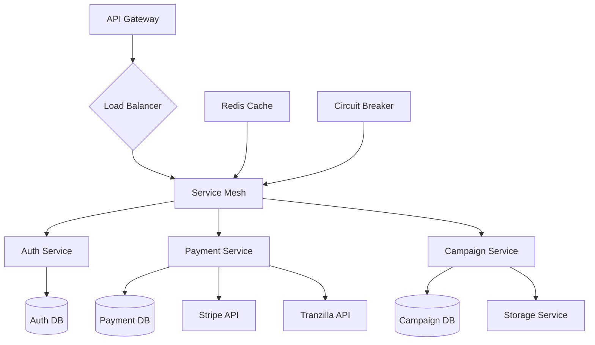
```mermaid
flowchart TD
    A[API Gateway] --> B{Load Balancer}
    B --> C[Service Mesh]
    C --> D[Auth Service]
    C --> E[Payment Service]
    C --> F[Campaign Service]
    
    D --> G[(Auth DB)]
    E --> H[(Payment DB)]
    F --> I[(Campaign DB)]
    
    E --> J[Stripe API]
    E --> K[Tranzilla API]
    F --> L[Storage Service]
    
    M[Redis Cache] --> C
    N[Circuit Breaker] --> C
```

### 3.3.4 API Security Controls

| Security Layer | Implementation |
|----------------|----------------|
| Authentication | OAuth 2.0 + JWT |
| Authorization | RBAC with custom claims |
| Rate Limiting | Token bucket algorithm |
| Input Validation | JSON Schema validation |
| Output Encoding | Context-aware encoding |
| Audit Logging | Structured logging to ELK |

# 4. TECHNOLOGY STACK

## 4.1 PROGRAMMING LANGUAGES

| Platform/Component | Language | Version | Justification |
|-------------------|----------|---------|---------------|
| Backend Services | Node.js | 18 LTS | - Event-driven architecture support<br>- Rich ecosystem for payment processing<br>- Strong async/await capabilities |
| Web Frontend | TypeScript | 5.0+ | - Type safety for large-scale application<br>- Enhanced IDE support<br>- Better maintainability |
| iOS App | Swift | 5.9+ | - Native performance<br>- Modern Apple platform features<br>- Strong security features |
| Android App | Kotlin | 1.9+ | - Modern Android development<br>- Null safety<br>- Coroutines for async operations |
| DevOps Scripts | Python | 3.11+ | - Infrastructure automation<br>- Rich AWS SDK support<br>- Clear syntax for maintenance |

## 4.2 FRAMEWORKS & LIBRARIES

### Backend Frameworks
| Framework | Version | Purpose |
|-----------|---------|---------|
| Express.js | 4.18+ | - API routing and middleware<br>- RESTful service implementation |
| NestJS | 10.0+ | - Microservices architecture<br>- Dependency injection<br>- TypeScript support |
| Socket.io | 4.7+ | - Real-time updates<br>- WebSocket management |
| Mongoose | 7.5+ | - MongoDB ODM<br>- Schema validation |

### Frontend Frameworks
| Framework | Version | Purpose |
|-----------|---------|---------|
| React | 18.2+ | - Component-based UI<br>- Virtual DOM performance |
| Material-UI | 5.14+ | - Consistent design system<br>- RTL support |
| Redux Toolkit | 1.9+ | - State management<br>- Side effect handling |
| React Native | 0.72+ | - Cross-platform mobile development<br>- Native performance |

## 4.3 DATABASES & STORAGE

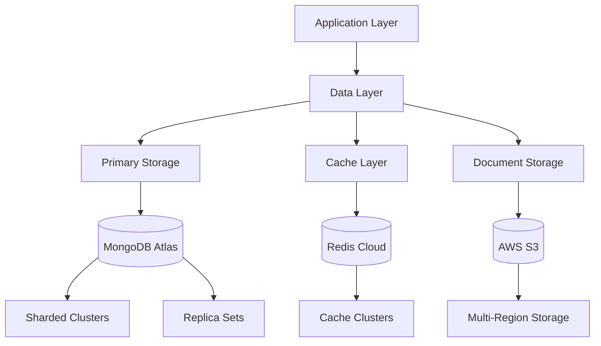
```mermaid
flowchart TD
    A[Application Layer] --> B[Data Layer]
    B --> C[Primary Storage]
    B --> D[Cache Layer]
    B --> E[Document Storage]
    
    C --> F[(MongoDB Atlas)]
    D --> G[(Redis Cloud)]
    E --> H[(AWS S3)]
    
    F --> I[Sharded Clusters]
    F --> J[Replica Sets]
    G --> K[Cache Clusters]
    H --> L[Multi-Region Storage]
```

### Storage Solutions
| Type | Technology | Purpose |
|------|------------|---------|
| Primary Database | MongoDB Atlas | - Document-oriented data storage<br>- Horizontal scaling<br>- Geographically distributed |
| Cache | Redis Cloud | - Session management<br>- Real-time data caching<br>- Rate limiting |
| Document Storage | AWS S3 | - Receipt storage<br>- Campaign media<br>- Backup storage |
| Search Engine | Elasticsearch | - Full-text search<br>- Analytics storage<br>- Log aggregation |

## 4.4 THIRD-PARTY SERVICES

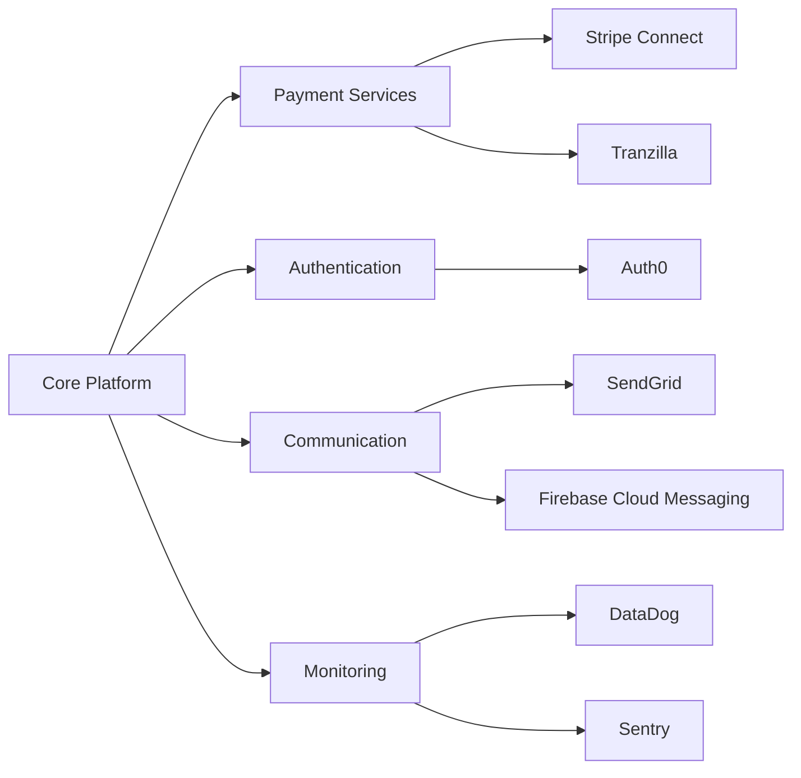
```mermaid
flowchart LR
    A[Core Platform] --> B[Payment Services]
    A --> C[Authentication]
    A --> D[Communication]
    A --> E[Monitoring]
    
    B --> F[Stripe Connect]
    B --> G[Tranzilla]
    C --> H[Auth0]
    D --> I[SendGrid]
    D --> J[Firebase Cloud Messaging]
    E --> K[DataDog]
    E --> L[Sentry]
```

### Service Integration Matrix
| Category | Service | Purpose |
|----------|---------|---------|
| Payments | Stripe Connect v2023-10 | International payment processing |
| Payments | Tranzilla v1.0 | Israeli market payments |
| Authentication | Auth0 | Identity management |
| Email | SendGrid | Transactional emails |
| Push Notifications | Firebase Cloud Messaging | Mobile notifications |
| Monitoring | DataDog | Infrastructure monitoring |
| Error Tracking | Sentry | Error reporting and tracking |

## 4.5 DEVELOPMENT & DEPLOYMENT

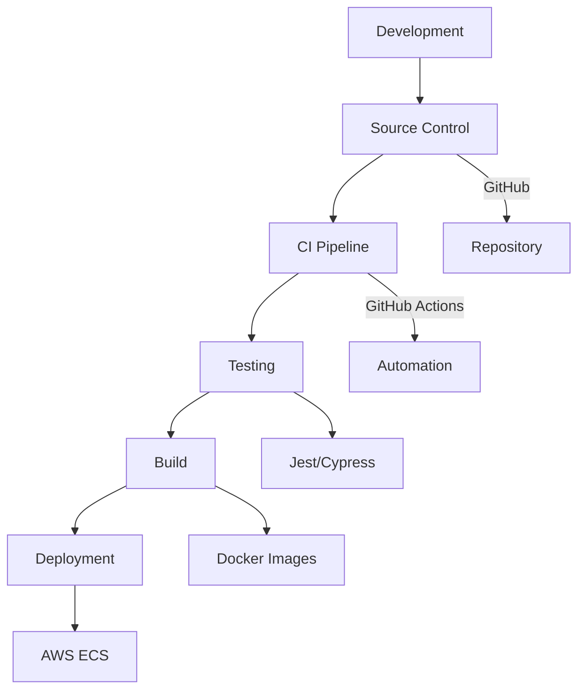
```mermaid
flowchart TD
    A[Development] --> B[Source Control]
    B --> C[CI Pipeline]
    C --> D[Testing]
    D --> E[Build]
    E --> F[Deployment]
    
    B --> |GitHub| G[Repository]
    C --> |GitHub Actions| H[Automation]
    D --> I[Jest/Cypress]
    E --> J[Docker Images]
    F --> K[AWS ECS]
```

### Development Tools
| Category | Tool | Purpose |
|----------|------|---------|
| IDE | VS Code | Primary development environment |
| Version Control | Git/GitHub | Source code management |
| API Testing | Postman | API development and testing |
| Code Quality | ESLint/Prettier | Code style enforcement |
| Documentation | OpenAPI 3.0 | API documentation |

### Deployment Pipeline
| Stage | Technology | Purpose |
|-------|------------|---------|
| Build | Docker | Application containerization |
| Registry | Amazon ECR | Container image storage |
| Orchestration | AWS ECS | Container orchestration |
| Infrastructure | Terraform | Infrastructure as code |
| CI/CD | GitHub Actions | Automated deployment |

# 5. SYSTEM DESIGN

## 5.1 USER INTERFACE DESIGN

### 5.1.1 Common Layout Components

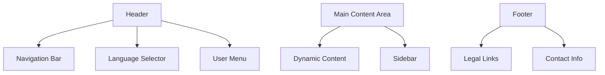
```mermaid
graph TD
    A[Header] --> B[Navigation Bar]
    A --> C[Language Selector]
    A --> D[User Menu]
    E[Main Content Area] --> F[Dynamic Content]
    E --> G[Sidebar]
    H[Footer] --> I[Legal Links]
    H --> J[Contact Info]
```

### 5.1.2 Key Interface Layouts

| Screen | Components | Responsive Behavior |
|--------|------------|-------------------|
| Donation Form | - Amount selector<br>- Payment method selector<br>- Association details<br>- Donation frequency | Stacks vertically on mobile |
| Campaign Dashboard | - Progress metrics<br>- Donor list<br>- Campaign stats<br>- Action buttons | Grid to list view transition |
| Association Profile | - Organization info<br>- Campaign showcase<br>- Donation history<br>- Document center | Tab-based navigation on mobile |
| Admin Console | - User management<br>- System metrics<br>- Configuration panels<br>- Audit logs | Collapsible sidebar on mobile |

### 5.1.3 Mobile-Specific Components

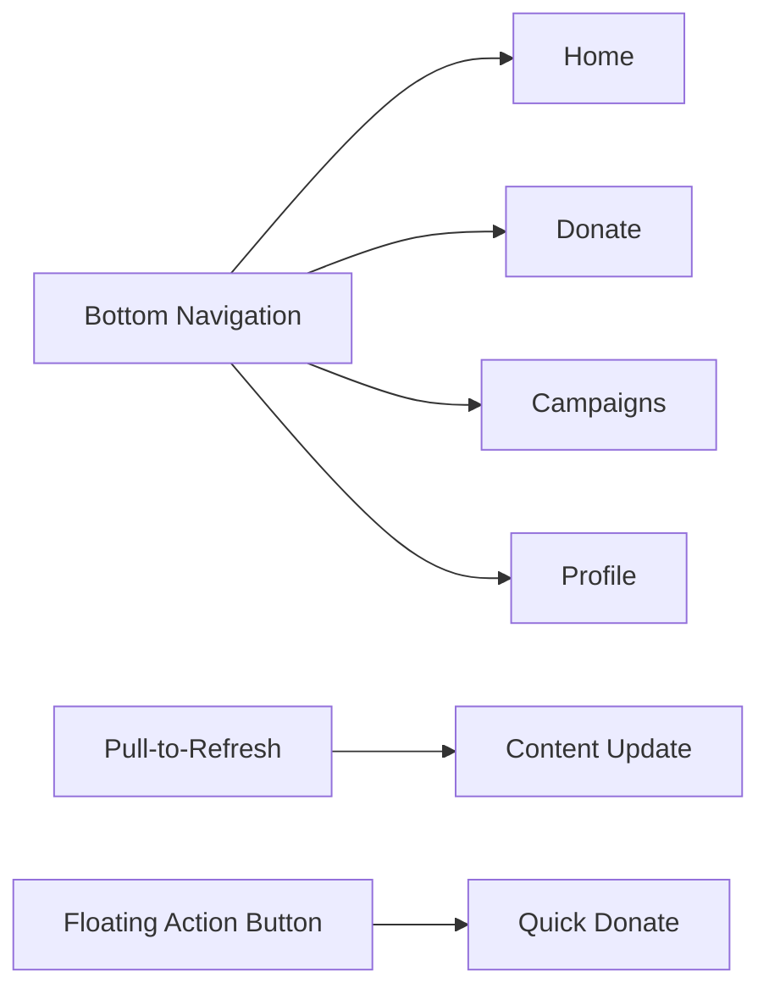
```mermaid
graph LR
    A[Bottom Navigation] --> B[Home]
    A --> C[Donate]
    A --> D[Campaigns]
    A --> E[Profile]
    F[Pull-to-Refresh] --> G[Content Update]
    H[Floating Action Button] --> I[Quick Donate]
```

## 5.2 DATABASE DESIGN

### 5.2.1 Collections Structure

| Collection | Sharding Key | Indexes | Relationships |
|------------|-------------|---------|---------------|
| users | email | - email (unique)<br>- created_at | - donations<br>- payment_methods |
| associations | country | - name<br>- status | - campaigns<br>- documents |
| donations | created_at | - user_id<br>- association_id | - users<br>- associations |
| campaigns | end_date | - association_id<br>- status | - donations<br>- associations |
| documents | owner_id | - type<br>- expiry_date | - users<br>- associations |

### 5.2.2 Data Distribution

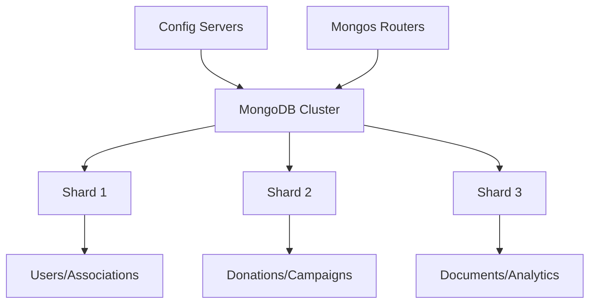
```mermaid
graph TD
    A[MongoDB Cluster] --> B[Shard 1]
    A --> C[Shard 2]
    A --> D[Shard 3]
    
    B --> E[Users/Associations]
    C --> F[Donations/Campaigns]
    D --> G[Documents/Analytics]
    
    H[Config Servers] --> A
    I[Mongos Routers] --> A
```

## 5.3 API DESIGN

### 5.3.1 REST Endpoints

| Endpoint | Method | Purpose | Authentication |
|----------|--------|---------|----------------|
| /api/v1/donations | POST | Create donation | JWT |
| /api/v1/campaigns | GET | List campaigns | Optional |
| /api/v1/associations | GET | List associations | Optional |
| /api/v1/documents | POST | Upload document | JWT |
| /api/v1/users/profile | PUT | Update profile | JWT |

### 5.3.2 WebSocket Events

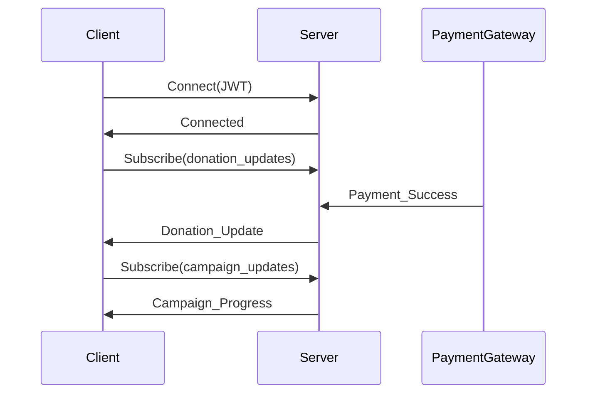
```mermaid
sequenceDiagram
    participant Client
    participant Server
    participant PaymentGateway
    
    Client->>Server: Connect(JWT)
    Server->>Client: Connected
    
    Client->>Server: Subscribe(donation_updates)
    PaymentGateway->>Server: Payment_Success
    Server->>Client: Donation_Update
    
    Client->>Server: Subscribe(campaign_updates)
    Server->>Client: Campaign_Progress
```

### 5.3.3 API Gateway Architecture

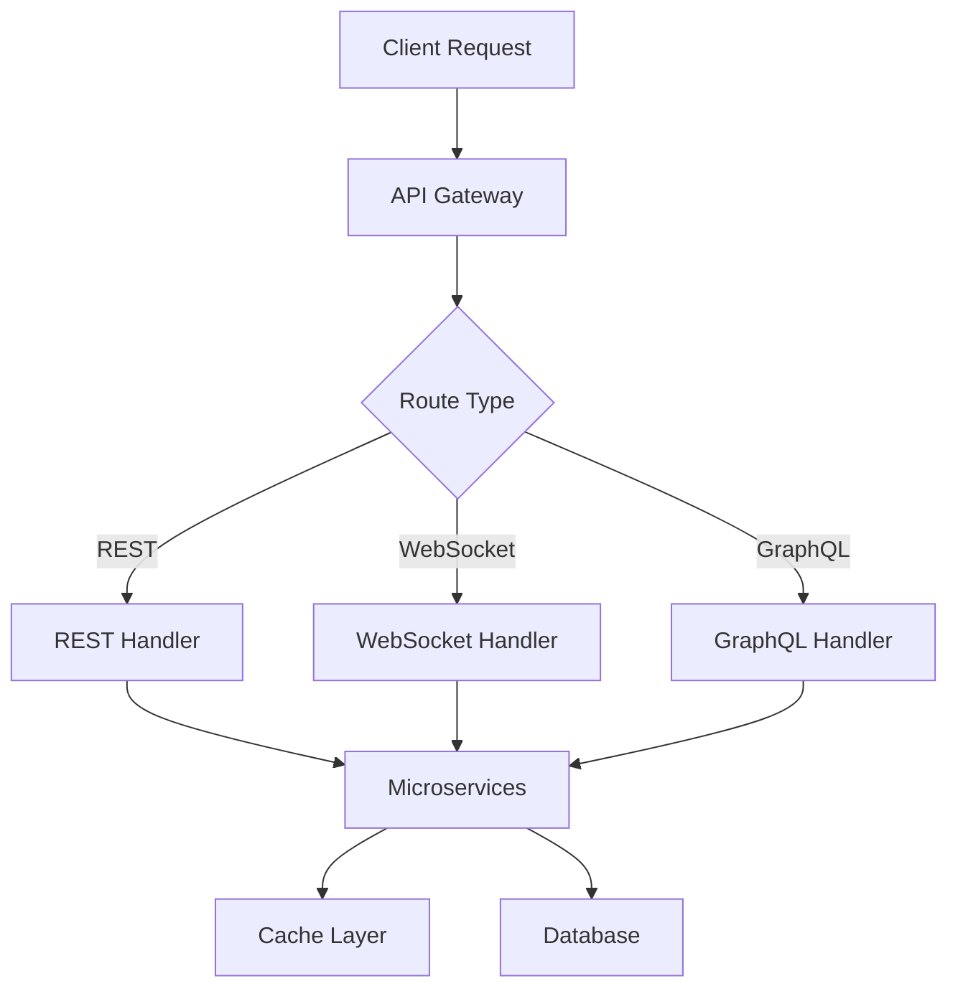
```mermaid
graph TD
    A[Client Request] --> B[API Gateway]
    B --> C{Route Type}
    C -->|REST| D[REST Handler]
    C -->|WebSocket| E[WebSocket Handler]
    C -->|GraphQL| F[GraphQL Handler]
    
    D --> G[Microservices]
    E --> G
    F --> G
    
    G --> H[Cache Layer]
    G --> I[Database]
```

### 5.3.4 Service Integration

| Service | Integration Method | Data Format | Security |
|---------|-------------------|-------------|-----------|
| Stripe Connect | REST API | JSON | API Key + OAuth |
| Tranzilla | REST API | XML | Terminal ID + Key |
| SendGrid | REST API | JSON | API Key |
| Firebase | SDK | JSON | Service Account |
| MongoDB | Wire Protocol | BSON | Certificate Auth |

### 5.3.5 Error Handling

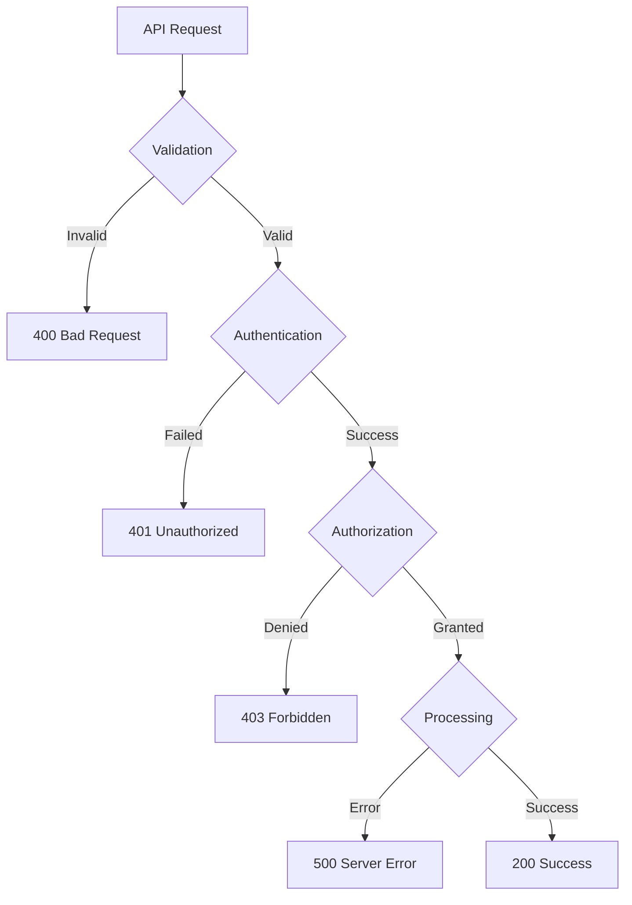
```mermaid
flowchart TD
    A[API Request] --> B{Validation}
    B -->|Invalid| C[400 Bad Request]
    B -->|Valid| D{Authentication}
    D -->|Failed| E[401 Unauthorized]
    D -->|Success| F{Authorization}
    F -->|Denied| G[403 Forbidden]
    F -->|Granted| H{Processing}
    H -->|Error| I[500 Server Error]
    H -->|Success| J[200 Success]
```

# 6. USER INTERFACE DESIGN

## 6.1 Common UI Components

### 6.1.1 Navigation Bar
```
+----------------------------------------------------------+
| [#] Dashboard   [@] Profile   [$] Donate   [*] Favorites  |
|                                         [=] Settings [?]   |
+----------------------------------------------------------+
```

### 6.1.2 Association Card Component
```
+----------------------------------------------------------+
| Organization Name                              [*] [Share] |
| [Logo]                                                    |
| Description text...                                       |
|                                                          |
| [============================] 75% of goal               |
| $15,000 raised of $20,000 goal                          |
|                                                          |
| [Donate Now]                [Learn More]                 |
+----------------------------------------------------------+
```

### 6.1.3 Donation Form
```
+----------------------------------------------------------+
| Make a Donation                                    [x]     |
+----------------------------------------------------------+
| Select Amount:                                            |
| [v] Currency: USD                                         |
|                                                          |
| ( ) $18    ( ) $36    ( ) $100    ( ) $180              |
| ( ) Custom Amount: [...........]                         |
|                                                          |
| Frequency:                                               |
| ( ) One-time   ( ) Monthly   ( ) Annual                 |
|                                                          |
| Payment Method:                                          |
| [v] Select Payment Method                                |
| [+] Add New Payment Method                               |
|                                                          |
| [ ] Make donation anonymous                              |
| [ ] Add dedication/memorial                              |
|                                                          |
| [Cancel]                      [Proceed to Payment]       |
+----------------------------------------------------------+
```

## 6.2 Mobile Interface Components

### 6.2.1 Mobile Navigation
```
+------------------+
| [<] Campaigns    |
+------------------+
|                  |
| Content Area     |
|                  |
|                  |
+------------------+
| [#]  [$]  [@]   |
+------------------+
```

### 6.2.2 Campaign Creation Flow
```
+------------------+
| New Campaign [x] |
+------------------+
| Step 1 of 3      |
| [=====>         ]|
|                  |
| Campaign Name:   |
| [............]   |
|                  |
| Description:     |
| [............]   |
| [............]   |
|                  |
| Goal Amount:     |
| [$............] |
|                  |
| [^] Add Image   |
|                  |
| [Back] [Next]    |
+------------------+
```

## 6.3 Dashboard Layouts

### 6.3.1 Association Dashboard
```
+----------------------------------------------------------+
| Welcome, Association Name                     [!] Alerts   |
+----------------------------------------------------------+
| Quick Stats:                                              |
| +-------------+ +-------------+ +-------------+           |
| | Total Raised| | Active     | | Monthly     |           |
| | $50,000    | | Campaigns  | | Donors      |           |
| |            | | 3          | | 125         |           |
| +-------------+ +-------------+ +-------------+           |
|                                                          |
| Recent Donations:                                        |
| +--------------------------------------------------+    |
| | Date     | Donor    | Amount  | Campaign         |    |
| | 10/25/23 | John D.  | $180    | Building Fund   |    |
| | 10/24/23 | Sarah M. | $36     | General         |    |
| +--------------------------------------------------+    |
|                                                          |
| [View All]                                               |
+----------------------------------------------------------+
```

### 6.3.2 Admin Control Panel
```
+----------------------------------------------------------+
| System Administration                                      |
+----------------------------------------------------------+
| +----------------+ +-------------------+ +----------------+|
| | Users          | | Associations      | | Transactions  ||
| |                | |                   | |               ||
| | [Search...]    | | [Search...]       | | [Search...]   ||
| |                | |                   | |               ||
| | + Active: 1205 | | + Pending: 5     | | + Today: 152  ||
| | + Pending: 23  | | + Active: 89     | | + Week: 1023  ||
| |                | | + Suspended: 2    | |               ||
| | [Manage]       | | [Manage]          | | [View All]    ||
| +----------------+ +-------------------+ +----------------+|
+----------------------------------------------------------+
```

## 6.4 UI Component Key

### Navigation Icons
- [#] Dashboard/Home
- [@] User Profile
- [$] Financial/Payment
- [*] Favorite/Save
- [?] Help/Support
- [=] Settings Menu
- [<] Back Navigation
- [>] Forward/Next
- [x] Close/Cancel
- [!] Alert/Notification
- [+] Add New
- [^] Upload

### Input Elements
- [...] Text Input Field
- [ ] Checkbox
- ( ) Radio Button
- [v] Dropdown Menu
- [Button] Action Button
- [====] Progress Bar

### Layout Elements
- +--+ Box Border
- |  | Vertical Border
- +-- Tree/Hierarchy Line

## 6.5 Responsive Breakpoints

| Device | Width Range | Layout Behavior |
|--------|-------------|-----------------|
| Mobile | 320px - 767px | Single column, stacked components |
| Tablet | 768px - 1023px | Two column, condensed navigation |
| Desktop | 1024px+ | Full layout, expanded navigation |

## 6.6 Theme Support

| Theme | Primary Color | Secondary Color | Background |
|-------|--------------|-----------------|------------|
| Light | #1976D2 | #424242 | #FFFFFF |
| Dark | #2196F3 | #FFFFFF | #121212 |
| High Contrast | #000000 | #FFFFFF | #FFFFFF |

All components support RTL (Right-to-Left) layout for Hebrew language support.

# 7. SECURITY CONSIDERATIONS

## 7.1 AUTHENTICATION AND AUTHORIZATION

### 7.1.1 Authentication Methods

| Method | Use Case | Implementation |
|--------|----------|----------------|
| JWT Tokens | API Authentication | - RS256 signing algorithm<br>- 15-minute access token expiry<br>- 7-day refresh token expiry |
| OAuth 2.0 | Social Login | - Google, Facebook, Apple providers<br>- Scope-limited permissions<br>- State parameter validation |
| 2FA | High-risk Operations | - Time-based OTP (TOTP)<br>- SMS fallback<br>- Recovery codes |
| Biometric | Mobile App | - TouchID/FaceID integration<br>- Android Biometric API<br>- Local key storage |

### 7.1.2 Authorization Model

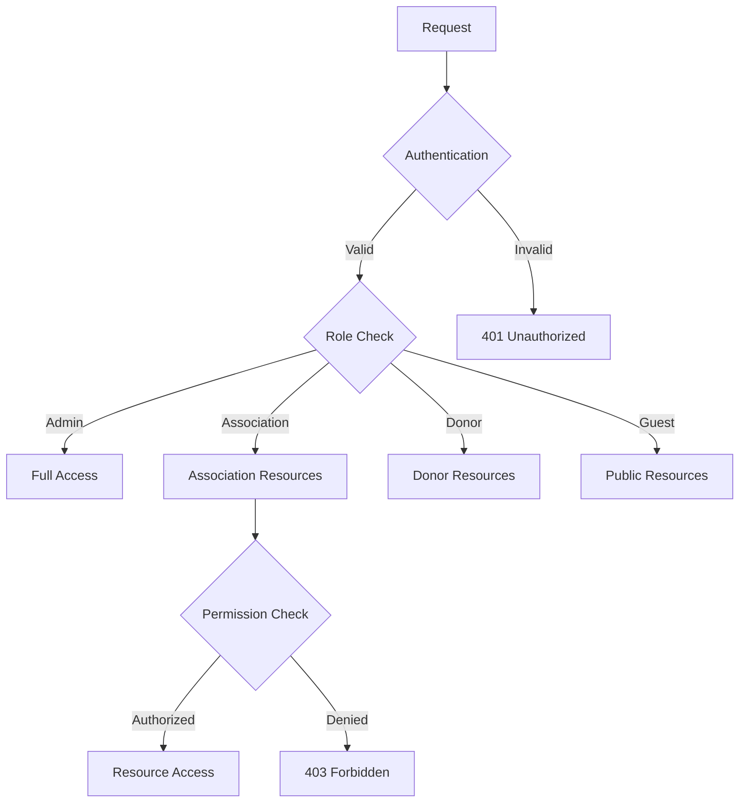
```mermaid
flowchart TD
    A[Request] --> B{Authentication}
    B -->|Valid| C{Role Check}
    B -->|Invalid| D[401 Unauthorized]
    
    C -->|Admin| E[Full Access]
    C -->|Association| F[Association Resources]
    C -->|Donor| G[Donor Resources]
    C -->|Guest| H[Public Resources]
    
    F --> I{Permission Check}
    I -->|Authorized| J[Resource Access]
    I -->|Denied| K[403 Forbidden]
```

### 7.1.3 Role-Based Access Control

| Role | Permissions | Access Level |
|------|------------|--------------|
| Admin | - User management<br>- System configuration<br>- Financial oversight | Full platform access |
| Association | - Campaign management<br>- Donor data (limited)<br>- Financial reports | Organization scope |
| Donor | - Personal profile<br>- Donation history<br>- Payment methods | User scope |
| Guest | - Public campaigns<br>- Association directory<br>- Registration | Public resources |

## 7.2 DATA SECURITY

### 7.2.1 Encryption Standards

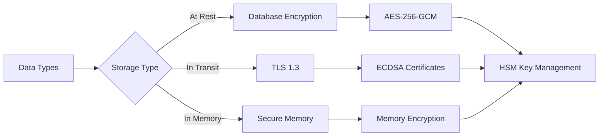
```mermaid
flowchart LR
    A[Data Types] --> B{Storage Type}
    B -->|At Rest| C[Database Encryption]
    B -->|In Transit| D[TLS 1.3]
    B -->|In Memory| E[Secure Memory]
    
    C --> F[AES-256-GCM]
    D --> G[ECDSA Certificates]
    E --> H[Memory Encryption]
    
    F --> I[HSM Key Management]
    G --> I
    H --> I
```

### 7.2.2 Data Classification

| Classification | Examples | Security Measures |
|----------------|----------|------------------|
| Critical | - Payment credentials<br>- Authentication tokens | - Field-level encryption<br>- HSM storage<br>- Audit logging |
| Sensitive | - Personal information<br>- Financial records | - Database encryption<br>- Access controls<br>- Data masking |
| Internal | - Campaign data<br>- Analytics | - Role-based access<br>- Transport encryption |
| Public | - Association profiles<br>- Campaign statistics | - Integrity checks<br>- Cache controls |

## 7.3 SECURITY PROTOCOLS

### 7.3.1 Network Security

```mermaid
flowchart TD
    A[Internet] --> B[WAF]
    B --> C[Load Balancer]
    C --> D[API Gateway]
    
    subgraph Security Zones
        D --> E[Application Layer]
        E --> F[Service Layer]
        F --> G[Database Layer]
    end
    
    H[Security Services] --> Security Zones
    H --> I[IDS/IPS]
    H --> J[SIEM]
    H --> K[DDoS Protection]
```

### 7.3.2 Security Controls

| Control Type | Implementation | Purpose |
|--------------|----------------|----------|
| Prevention | - WAF rules<br>- Input validation<br>- Rate limiting | Block known attack vectors |
| Detection | - SIEM integration<br>- Anomaly detection<br>- Security scanning | Identify security events |
| Response | - Automated blocking<br>- Incident playbooks<br>- Forensic logging | Handle security incidents |
| Recovery | - Backup restoration<br>- System hardening<br>- Patch management | Restore secure state |

### 7.3.3 Compliance Protocols

| Requirement | Implementation | Validation |
|-------------|----------------|------------|
| PCI DSS | - Network segmentation<br>- Encryption standards<br>- Access controls | Quarterly ASV scans |
| GDPR | - Data minimization<br>- Privacy controls<br>- Right to erasure | Annual audit |
| SOC 2 | - Security policies<br>- Monitoring controls<br>- Change management | External audit |
| ISO 27001 | - Risk management<br>- Security framework<br>- ISMS implementation | Certification |

### 7.3.4 Security Monitoring

```mermaid
flowchart LR
    A[Security Events] --> B{Event Type}
    B -->|Access| C[Access Logs]
    B -->|Security| D[Security Logs]
    B -->|Audit| E[Audit Logs]
    
    C --> F[Log Analytics]
    D --> F
    E --> F
    
    F --> G[SIEM]
    G --> H[Alert Rules]
    H --> I[Security Team]
    H --> J[Automated Response]
```

# 8. INFRASTRUCTURE

## 8.1 DEPLOYMENT ENVIRONMENT

### 8.1.1 Environment Overview

| Environment | Purpose | Configuration |
|-------------|---------|---------------|
| Development | Local development and testing | - Docker-based local environment<br>- Local MongoDB and Redis instances<br>- Mock payment services |
| Staging | Pre-production testing and validation | - AWS infrastructure mirror<br>- Sandbox payment integrations<br>- Full monitoring suite |
| Production | Live system deployment | - Multi-region AWS deployment<br>- High availability configuration<br>- Geographic load balancing |

### 8.1.2 Production Architecture

```mermaid
flowchart TD
    subgraph "AWS Global"
        Route53[Route 53 DNS]
        CloudFront[CloudFront CDN]
        
        subgraph "Primary Region"
            ALB1[Application Load Balancer]
            ECS1[ECS Cluster]
            RDS1[MongoDB Atlas]
            Redis1[Redis Cluster]
            
            ALB1 --> ECS1
            ECS1 --> RDS1
            ECS1 --> Redis1
        end
        
        subgraph "Secondary Region"
            ALB2[Application Load Balancer]
            ECS2[ECS Cluster]
            RDS2[MongoDB Atlas]
            Redis2[Redis Cluster]
            
            ALB2 --> ECS2
            ECS2 --> RDS2
            ECS2 --> Redis2
        end
        
        Route53 --> CloudFront
        CloudFront --> ALB1
        CloudFront --> ALB2
    end
```

## 8.2 CLOUD SERVICES

### 8.2.1 AWS Service Stack

| Service | Purpose | Configuration |
|---------|---------|---------------|
| ECS Fargate | Container orchestration | - Serverless container execution<br>- Auto-scaling groups<br>- Task definitions |
| CloudFront | Content delivery | - Global edge locations<br>- SSL/TLS termination<br>- DDoS protection |
| Route 53 | DNS management | - Latency-based routing<br>- Health checks<br>- Failover configuration |
| S3 | Object storage | - Multi-region replication<br>- Versioning enabled<br>- Lifecycle policies |
| CloudWatch | Monitoring | - Custom metrics<br>- Log aggregation<br>- Alerting |
| WAF | Security | - IP filtering<br>- Rate limiting<br>- SQL injection protection |

### 8.2.2 Third-Party Services

| Service | Provider | Purpose |
|---------|----------|---------|
| MongoDB Atlas | MongoDB | - Managed database service<br>- Automatic sharding<br>- Backup management |
| Redis Enterprise | Redis Labs | - Managed cache service<br>- Cross-region replication<br>- High availability |
| DataDog | Datadog Inc. | - APM monitoring<br>- Infrastructure metrics<br>- Log management |

## 8.3 CONTAINERIZATION

### 8.3.1 Container Architecture

```mermaid
graph TD
    subgraph "Container Registry"
        ECR[Amazon ECR]
    end
    
    subgraph "Application Containers"
        API[API Services]
        Worker[Background Workers]
        Frontend[Web Frontend]
    end
    
    subgraph "Supporting Containers"
        Redis[Redis Cache]
        Nginx[Nginx Proxy]
        Logger[Fluentd Logger]
    end
    
    ECR --> API
    ECR --> Worker
    ECR --> Frontend
    ECR --> Supporting Containers
```

### 8.3.2 Container Specifications

| Container | Base Image | Resource Limits |
|-----------|------------|-----------------|
| API Services | node:18-alpine | CPU: 1vCPU<br>Memory: 2GB |
| Frontend | nginx:alpine | CPU: 0.5vCPU<br>Memory: 1GB |
| Workers | node:18-alpine | CPU: 1vCPU<br>Memory: 2GB |
| Redis Cache | redis:alpine | CPU: 0.5vCPU<br>Memory: 1GB |

## 8.4 ORCHESTRATION

### 8.4.1 ECS Configuration

```mermaid
graph TD
    subgraph "ECS Cluster"
        subgraph "Service Discovery"
            CloudMap[AWS Cloud Map]
        end
        
        subgraph "Task Definitions"
            API[API Tasks]
            Worker[Worker Tasks]
            Frontend[Frontend Tasks]
        end
        
        subgraph "Auto Scaling"
            ASG[Application Auto Scaling]
            CP[Capacity Provider]
        end
        
        CloudMap --> API
        CloudMap --> Worker
        CloudMap --> Frontend
        ASG --> CP
        CP --> Task Definitions
    end
```

### 8.4.2 Service Configuration

| Service | Scaling Policy | Health Check |
|---------|---------------|--------------|
| API Service | Target tracking - CPU 70% | HTTP check /health |
| Frontend | Target tracking - Request count | HTTP check /ping |
| Workers | Queue depth based | Process check |
| Cache | Memory utilization | Redis ping |

## 8.5 CI/CD PIPELINE

### 8.5.1 Pipeline Architecture

```mermaid
flowchart LR
    subgraph "Source"
        Git[GitHub Repository]
    end
    
    subgraph "Build"
        Actions[GitHub Actions]
        Tests[Test Suite]
        Build[Docker Build]
    end
    
    subgraph "Deploy"
        ECR[Amazon ECR]
        ECS[ECS Deploy]
        Monitor[Deployment Monitor]
    end
    
    Git --> Actions
    Actions --> Tests
    Tests --> Build
    Build --> ECR
    ECR --> ECS
    ECS --> Monitor
```

### 8.5.2 Pipeline Stages

| Stage | Tools | Actions |
|-------|-------|---------|
| Source Control | GitHub | - Branch protection<br>- Pull request reviews<br>- Automated linting |
| Build | GitHub Actions | - Unit tests<br>- Integration tests<br>- Security scans |
| Artifact Creation | Docker | - Multi-stage builds<br>- Image scanning<br>- Version tagging |
| Deployment | AWS CodeDeploy | - Blue-green deployment<br>- Rollback capability<br>- Health checks |
| Monitoring | DataDog | - Performance monitoring<br>- Error tracking<br>- Alerting |

# APPENDICES

## A.1 ADDITIONAL TECHNICAL INFORMATION

### A.1.1 Payment Gateway Integration Details

| Gateway | Integration Type | Features | Market |
|---------|-----------------|-----------|---------|
| Stripe Connect | REST API | - Multi-currency support<br>- Automated payouts<br>- Platform fee handling | International |
| Tranzilla | XML API | - Local bank integration<br>- Israeli shekel support<br>- Direct bank transfers | Israel |

### A.1.2 Document Processing Flow

```mermaid
flowchart TD
    A[Document Upload] --> B{Document Type}
    B -->|Tax Receipt| C[CERFA Generation]
    B -->|Association Docs| D[Verification Queue]
    B -->|Financial Reports| E[Analytics Processing]
    
    C --> F[Digital Signature]
    D --> G[Admin Review]
    E --> H[Data Extraction]
    
    F --> I[Storage]
    G --> I
    H --> I
    
    I --> J[Access Control]
    J --> K[User Access]
    J --> L[Association Access]
    J --> M[Admin Access]
```

### A.1.3 Caching Strategy

| Cache Layer | Technology | TTL | Purpose |
|-------------|------------|-----|---------|
| Browser Cache | Service Worker | 24 hours | Static assets |
| CDN Cache | CloudFront | 1 hour | Public content |
| Application Cache | Redis | 15 minutes | Session data |
| Database Cache | MongoDB | 5 minutes | Query results |

## A.2 GLOSSARY

| Term | Definition |
|------|------------|
| Association Dashboard | Administrative interface for charitable organizations to manage donations and campaigns |
| Campaign Template | Predefined campaign structure for quick deployment of fundraising initiatives |
| Donation Flow | Step-by-step process for completing a charitable contribution |
| Donor Portal | User interface for individuals to make and manage donations |
| Payment Gateway | Service that processes electronic payment transactions |
| Platform Fee | Commission charged by the platform for processing donations |
| Tax Receipt | Official document for tax deduction purposes (varies by country) |
| Verification Queue | System for managing document verification workflows |

## A.3 ACRONYMS

| Acronym | Full Form |
|---------|-----------|
| API | Application Programming Interface |
| AWS | Amazon Web Services |
| BSON | Binary JSON |
| CDN | Content Delivery Network |
| CERFA | Certificat de don aux œuvres |
| ECS | Elastic Container Service |
| HSM | Hardware Security Module |
| JWT | JSON Web Token |
| MUI | Material-UI |
| ODM | Object Document Mapper |
| PCI | Payment Card Industry |
| REST | Representational State Transfer |
| SDK | Software Development Kit |
| SPA | Single Page Application |
| SSL | Secure Sockets Layer |
| TDE | Transparent Data Encryption |
| UI/UX | User Interface/User Experience |
| WAF | Web Application Firewall |
| WSS | WebSocket Secure |
| XML | Extensible Markup Language |

## A.4 DEVELOPMENT STANDARDS

### A.4.1 Code Quality Metrics

```mermaid
flowchart LR
    A[Code Quality] --> B{Quality Gates}
    B --> C[Test Coverage]
    B --> D[Code Complexity]
    B --> E[Duplication]
    
    C --> F[>80% Coverage]
    D --> G[<15 Complexity]
    E --> H[<3% Duplication]
    
    F --> I[Quality Pass]
    G --> I
    H --> I
    
    I --> J[Deployment Approval]
```

### A.4.2 Documentation Requirements

| Document Type | Update Frequency | Review Process |
|---------------|------------------|----------------|
| API Documentation | Per release | Technical review |
| User Guides | Monthly | UX team review |
| Security Protocols | Quarterly | Security audit |
| System Architecture | Per major version | Architecture review |
| Release Notes | Per deployment | Product team review |