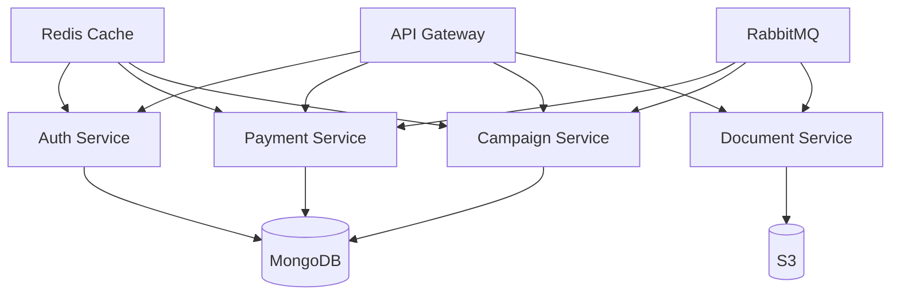
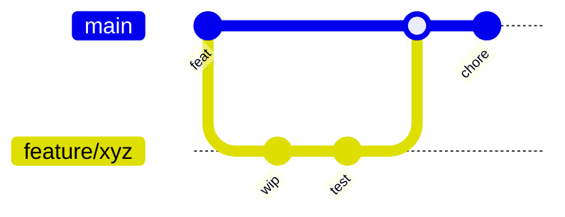
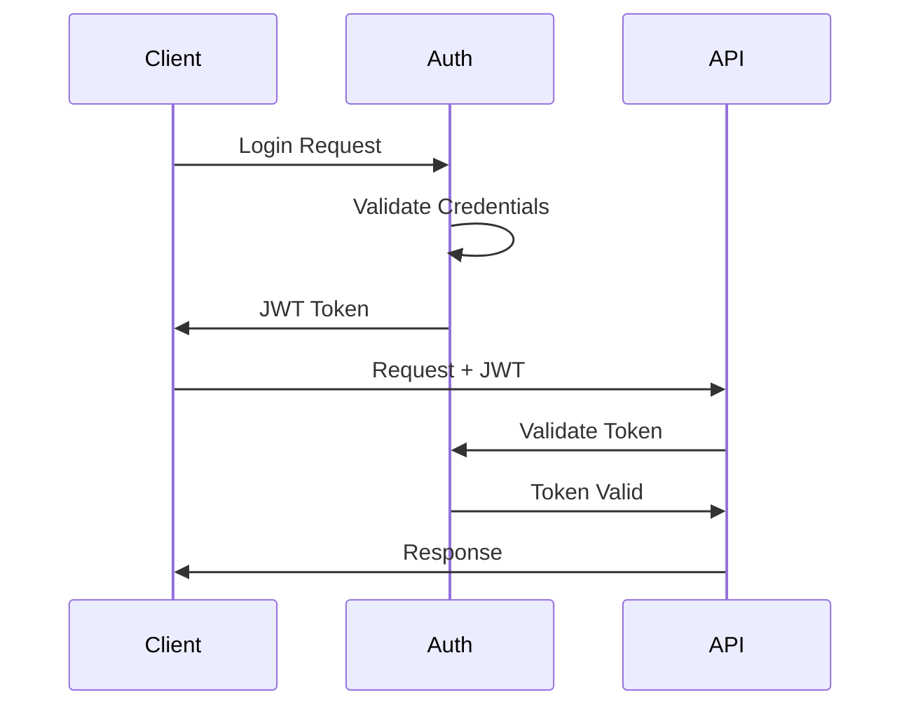
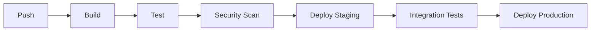

# International Jewish Association Donation Platform - Backend Services

## Table of Contents
- [Overview](#overview)
- [Architecture](#architecture)
- [Getting Started](#getting-started)
- [Development](#development)
- [API Documentation](#api-documentation)
- [Testing](#testing)
- [Deployment](#deployment)
- [Security](#security)
- [Monitoring](#monitoring)
- [Contributing](#contributing)

## Overview

The International Jewish Association Donation Platform backend services provide a robust, scalable microservices architecture for managing charitable donations, campaigns, and associations worldwide. Built with Node.js/NestJS, the system handles international transactions through multiple payment gateways while ensuring compliance with various jurisdictions.

### Key Features
- Multi-currency donation processing
- Campaign and lottery management
- Document generation and verification
- Real-time analytics and reporting
- Multi-region deployment support
- Comprehensive security controls

### Technology Stack
- **Runtime**: Node.js 18 LTS
- **Framework**: NestJS 10.x
- **Database**: MongoDB Atlas (Sharded Clusters)
- **Cache**: Redis Enterprise
- **Message Queue**: RabbitMQ
- **Container Runtime**: Docker
- **Orchestration**: AWS ECS Fargate
- **API Documentation**: OpenAPI 3.0/Swagger

## Architecture

### Microservices Architecture


### Service Components
- **API Gateway**: Request routing, rate limiting, API versioning
- **Auth Service**: Authentication, authorization, user management
- **Payment Service**: Transaction processing, payment gateway integration
- **Campaign Service**: Campaign management, donation tracking
- **Document Service**: Document generation, storage, verification

## Getting Started

### Prerequisites
- Node.js 18 LTS
- Docker & Docker Compose
- MongoDB Atlas account
- AWS account (for production deployment)

### Local Development Setup
1. Clone the repository
```bash
git clone <repository-url>
cd src/backend
```

2. Install dependencies
```bash
npm install
```

3. Configure environment variables
```bash
cp .env.example .env
# Edit .env with your configuration
```

4. Start development environment
```bash
# Start infrastructure services
docker-compose up -d

# Start development server
npm run start:dev
```

## Development

### Code Style
Follow Google JavaScript Style Guide with additional TypeScript considerations:
- Use strict TypeScript configuration
- Maintain 80% or higher test coverage
- Follow SOLID principles
- Implement proper error handling

### Git Workflow


### Branch Strategy
- `main`: Production-ready code
- `develop`: Integration branch
- `feature/*`: New features
- `fix/*`: Bug fixes
- `release/*`: Release preparation

## API Documentation

### OpenAPI/Swagger
- Development: `http://localhost:3000/api/docs`
- Staging: `https://api.staging.domain/docs`
- Production: `https://api.domain/docs`

### Authentication


## Testing

### Test Types
- Unit Tests: `npm run test`
- Integration Tests: `npm run test:e2e`
- Coverage: `npm run test:cov`

### Coverage Requirements
- Statements: ≥80%
- Branches: ≥80%
- Functions: ≥80%
- Lines: ≥80%

## Deployment

### CI/CD Pipeline


### Environment Configuration
- Development: Local environment
- Staging: AWS ECS Staging
- Production: AWS ECS Production (Multi-region)

## Security

### Security Controls
- JWT-based authentication
- Role-based access control
- Field-level encryption
- Rate limiting
- WAF protection
- Audit logging

### Compliance
- PCI DSS Level 1
- GDPR/CCPA compliance
- SOC 2 Type II
- ISO 27001

## Monitoring

### Observability Stack
- Metrics: Prometheus
- Logging: ELK Stack
- Tracing: Jaeger
- Alerting: PagerDuty
- Dashboards: Grafana

### Key Metrics
- Request latency
- Error rates
- Transaction success rate
- System resource utilization
- Cache hit ratio

## Contributing

### Development Process
1. Fork the repository
2. Create feature branch
3. Implement changes
4. Write/update tests
5. Submit pull request
6. Code review
7. Merge to develop

### Documentation Requirements
- Update API documentation
- Include architecture diagrams
- Document configuration changes
- Update changelog
- Add migration guides if needed

### Contact
For questions or support:
- Technical Lead: [email]
- DevOps Team: [email]
- Security Team: [email]

## License

Copyright © 2023 International Jewish Association Donation Platform